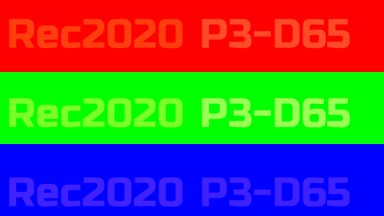
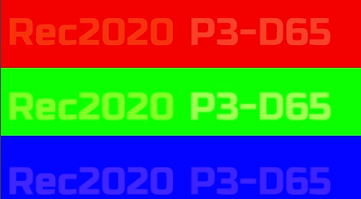
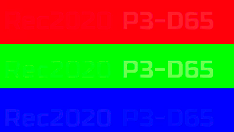

# Media Encoding with ffmpeg  <a name="encodestart"></a>

We will break the encoding process into three parts:
1. The RGB to YCrCb conversion.
2. The encoding process itself.
3. Metadata tagging.

# Color space conversion.  <a name="Color-space-conversion"></a>

The color space conversion we are assuming is being done using tools such as [Nuke](https://www.foundry.com/products/nuke-family/nuke) or [oiiotool](https://openimageio.readthedocs.io/en/latest/oiiotool.html) using [OCIO](https://opencolorio.org/). We strongly recommend using the ACES configuration whenever possible, since it provides a good baseline for colorspace conversion. Note, we may mention the use of Nuke a number of times, there are now a large number of 3rd party tools that will also do great at this color space conversion using OCIO.

Typically, we would assume that an intermediate file would get written out, such as PNG, TIF or DPX for processing in ffmpeg. NOTE, by default the nuke PNG writer will have the slow compression enabled, this does add a little time that is unnecessary for the sort of intermediate file we are using. In the nuke SDK they do provide the source for the PNG writer, so it is possible to get this disabled. However, you may find that switching to Tif will have the same result.


# RGB to YCrCb Conversion <a name="yuv"></a>
This is the area you are most likely to get wrong. By default
As a rule of thumb, we would like ffmpeg to do as little as possible in terms of color space conversion. i.e. what comes in goes out. The problem is that most of the codecs are doing some sort of RGB to YUV conversion (technically YCrCb). The notable exception is x264rgb (see below).

The main problem is that ffmpeg by default assumes that any unknown still image format has a color space of[rec601](https://en.wikipedia.org/wiki/Rec._601) which is very unlikely to be the color space your source media was generate in. So unless you tell it otherwise it will attempt to convert from that colorspace producing a color shift.

Separately, all the video formats typically do not use the full numeric range but instead the R', B', G' and Y' (luminance) channel have a nominal range of [16..235]  and the CB and CR channels have a nominal range of [16..240] with 128 as the neutral value. This frequently results in quantisation artifacts for 8-bit encoding (the standard for web playback). This fortunately is something you can change, see TV vs. Full range. below. The other option is to use higher bit depth, e.g. 10-bit or 12 bit for formats such as ProRes (see later).

For more information, see: [https://trac.ffmpeg.org/wiki/colorspace](https://trac.ffmpeg.org/wiki/colorspace)

TODO -- Review the SWS_Flags.


For examples comparing these see: [here](https://richardssam.github.io/ffmpeg-tests/tests/chip-chart-yuvconvert/compare.html)

## colormatrix filter
```
-vf "colormatrix=bt470bg:bt709"
```
This is the most basic colorspace filtering. bt470bg is essentially part of the bt601 spec.  See: [https://www.ffmpeg.org/ffmpeg-filters.html#colormatrix]()
This is the most basic colorspace filtering. bt470bg is essentially part of the bt601 spec.  See: [https://www.ffmpeg.org/ffmpeg-filters.html#colormatrix]()
e.g.
```
ffmpeg -y -i ../sourceimages/chip-chart-1080-noicc.png -sws_flags spline+accurate_rnd+full_chroma_int -vf "colormatrix=bt470bg:bt709" -c:v libx264 -preset placebo -qp 0 -x264-params "keyint=15:no-deblock=1" -pix_fmt yuv444p10le -qscale:v 1 -color_range 1 -colorspace 1 -color_primaries 1 -color_trc 1 ./chip-chart-yuvconvert/spline444colormatrix2.mp4
```
## colorspace filter
```
 -vf "colorspace=bt709:iall=bt601-6-625:fast=1"
 ```
Using colorspace filter, better quality filter, SIMD so faster too, can support 10-bit too.  The second part -vf "colorspace=bt709:iall=bt601-6-625:fast=1" encodes for the output being bt709, rather than the default bt601 matrix. iall=bt601-6-625 says to treat all the input (colorspace, primaries and transfer function) with the bt601-6-625 label). fast=1 skips gamma/primary conversion in a mathematically correct way.  See:  [https://ffmpeg.org/ffmpeg-filters.html#colorspace](https://ffmpeg.org/ffmpeg-filters.html#colorspace)
e.g.
```
ffmpeg -y -i ../sourceimages/chip-chart-1080-noicc.png -sws_flags spline+accurate_rnd+full_chroma_int -vf "colorspace=bt709:iall=bt601-6-625:fast=1" -c:v libx264 -preset placebo -qp 0 -x264-params "keyint=15:no-deblock=1" -pix_fmt yuv444p10le -qscale:v 1 -color_range 1 -colorspace 1 -color_primaries 1 -color_trc 1 ./chip-chart-yuvconvert/spline444colorspace.mp4
```
## libswscale filter
```
-vf "scale=in_range=full:in_color_matrix=bt709:out_range=tv:out_color_matrix=bt709"
```
Using the libswscale library. Seems similar to colorspace, but with image resizing, and levels built in.  [https://www.ffmpeg.org/ffmpeg-filters.html#scale-1](https://www.ffmpeg.org/ffmpeg-filters.html#scale-1)

This is the recommended filter.
e.g.
```
ffmpeg -y -i ../sourceimages/chip-chart-1080-noicc.png -sws_flags spline+accurate_rnd+full_chroma_int+full_chroma_inp -vf "scale=in_range=full:in_color_matrix=bt709:out_range=tv:out_color_matrix=bt709" -c:v libx264 -preset placebo -qp 0 -x264-params "keyint=15:no-deblock=1" -pix_fmt yuv444p10le -qscale:v 1 -color_range 1 -colorspace 1 -color_primaries 1 -color_trc 1 ./chip-chart-yuvconvert/spline444out_color_matrix.mp4
```


# Metadata NCLC/NCLX <a name="nclc"></a>
There are a number of metadata flags designed to help the player know what colorspace the media is in, so it can correctly interpret it for playback. We do recommend adding the metadata tags to media, particularly if you are reviewing it on a web browser, however there are a lot of gotchas here, please see the section on [Web Review](#review).

The NCLC/NCLX is defined as a ISO spec here (see https://www.iso.org/standard/73412.html). The numbers below are part of the definition. NCLC stands for Non-Consistent Luminance Coding, a brief overview of its history is here. For MP4 files, its also known as NCLX. Additionally this metadata can also be represented in the h264 metadata stream in the video usability Information (VUI) block.

You can read the metadata using mp4box.js which is a visual browser of the mp4 metadata, and look at moov/trak/mdia/minf/stbl/stsd/avc1/colr

NOTE: None of the flags below affect the encoding of the source imagery, they are meant to be used to guide how the mp4 file is decoded.

The docs are pretty sparse for this, some of the better info is [FFmpeg/pixfmt.h at master](https://github.com/FFmpeg/FFmpeg/blob/master/libavutil/pixfmt.h)
# Gamut colorprimaries <a name="gamut"></a>

How good is your browser at remapping source media of an expanded gamut (e.g. rec2020 or Display-p3) to your display.
Your monitor reports:

<table class='compare' width='100%'>
<TR><TH>PNG file</TH><TH>Mp4 file (which should match PNG file)</TH></TR>
<TR><TD></td><td><video   width='406'   ><source src='gamuttests/iccgamut/greyscale-rec2020.mp4' type='video/mp4'/></video></td></TR>
</table>


<table class='compare' width='100%'>
<TR><TD></TD><TD>What the image should look like if nothing is working, or you have a rec2020 monitor.</TD></TR>
<TR><TD></TD><TD>What the image should look like if you have a display-p3 monitor.</TD></TR>
</table>

Chrome on windows, and Safari and Chrome on IOS will always assume the display is sRGB. In theory [chrome://flags/#force-color-profile](chrome://flags/#force-color-profile) should give you some settings for this, but it seems to be ignored.


# Web Review <a name="webreview"></a>
See:
* [NCLC Testing Overview](https://richardssam.github.io/ffmpeg-tests/compare.html) This is an overview of the NCLC Tag tests for web review.
* [Comparing different outputs for -color_trc](https://richardssam.github.io/ffmpeg-tests/tests/greyramp-osx/compare.html) - Showing what the -color_trc flag is doing, compared to embedding in mov and png.
* [Comparing different outputs for the -colorprimaries](https://richardssam.github.io/ffmpeg-tests/gamuttests/iccgamut/compare.html)
