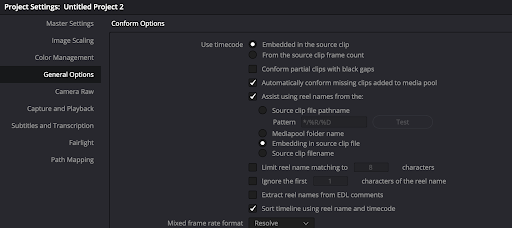

<style>
.compare th, .compare td {
    padding: 2px 2px !important;
    border: 0px solid #e9ebec !important;
}
</style>

# Timecode and Editorial Workflow


<details open markdown="block">
  <summary>
    Table of contents
  </summary>
  {: .text-delta }
1. TOC
{:toc}
</details>

When delivering media to editorial, it's useful to attach a start timecode value to the media.

This can be done with the -timecode flag:

E.g.


```
ffmpeg -r 24 -start_number <STARTFRAME> -i inputfile.%04d.png \
        -vf "scale=in_color_matrix=bt709:out_color_matrix=bt709" \
        -frames:v 100 -c:v libx264 -preset slow -pix_fmt yuv420p \
        -timecode  <STARTFRAMETIMECODE>
        outputfile.mp4
```


There are three approaches for what to use for the timecode:
* [Convert the start frame number](#start-frame-as-timecode) to the related timecode.
* Use the timecode from the [original plate](#start-frame-as-original-plate-timecode)
* A "fixed" timecode for all deliverables


## Start Frame as Timecode

It's extremely common to use a start frame of 1001 for a shot at the beginning of production, rather than frame 0. The three big reasons for this are:

1. Frames are automatically padded to 4 digits (which is really common for VFX work).
2. If you do need to add additional frames to the head of the shot, either because editorial requests it, then there is plenty of wiggle room without requiring moving animation (which can be problematic if multiple departments are involved).
3. It's easy for simulation to have ‘pre-roll’ time without going into negative frames.

It's also common for VFX shows to deliver handles on the animation, e.g. if 8 frames of handle are expected to be provided to the VFX provider, then the first frame of animation would be frame 1009. Similarly it's common to have a slate as the first frame, so assuming frame 1001 is the first frame of the handles, 1000 would be the slate.

By remapping the frame number to a timecode number, e.g. frame 1001 to 00:00:41:07 if later the editor decided that the first frame of the delivery was going to be 1009 (i.e. TC 00:00:42:01) you would have an issue if no timecode existed on the clip, since they would have some versions of the clip where the frame number is 1001, and some that are 1009 (which is why burn-in frame numbers are so important). By adding the timecode, its possible to automate the process, dropping in different versions of the clip (whether the start frame is 1001 or 1009) it should conform correctly.

Converting the frame number to timecode can be done using OTIO:

```
import opentimelineio as otio
start_frame = 1001
frame_rate = 24.0
timecode = otio.opentime.RationalTime(start_frame, rate=frame_rate).to_timecode()
```

## Start Frame as Original Plate Timecode

Another scenario is that the client is delivering a single clip, that your facility is adding media to, and for a similar reason to the above, it would be helpful if the timecode of the media that you return to the client, contains the same timecode as the delivered media.

This has a similar benefit in terms of conform, you can add or remove frames, and the conform will do the right thing, but it does require *a lot* more tracking, since if the frames are trimmed off the beginning, you will need to calculate the new timecode. Equally problematic is if you have multiple plates since you would need to track which clip is the “Master” in terms of timecode and make sure any deliveries for the shot are appropriately using that timecode.


## Reel Name

While tracking the timecode for dailies may be too complex, it can be extremely useful for making proxies for source camera files. But the timecode alone is not enough, you also would need the reel-name, which typically is closely mapped to the filename of the original camera files.

For a Quicktime the reel name can be defined with the -metadata:s:v:0 flag:

```
ffmpeg -f lavfi -i testsrc -t 1 -timecode 01:00:00:00 -metadata:s:v:0 reel_name=ABCD123 OUTPUT.mov
```


For a Op1a mxf file it can be defined with a -metadata flag:


```
ffmpeg -f lavfi -i testsrc -t 1 -timecode 01:00:00:00 -metadata reel_name=ABCD123 OUTPUT.mxf
```

However, metadata for reel-name is not consistently supported across the applications:

<table>
  <tr>
   <td>
   </td>
   <td>Resolve
   </td>
   <td>AVID MC 
   </td>
   <td>Premiere
   </td>
   <td>Hiero
   </td>
  </tr>
  <tr>
   <td>Quicktime -metadata:s:v:0 reel_name=xxx
   </td>
   <td>x
   </td>
   <td>
   </td>
   <td>x
   </td>
   <td>
   </td>
  </tr>
  <tr>
   <td>Mxf -metadata reel_name=xxx
   </td>
   <td>x
   </td>
   <td>X (when linked)
   </td>
   <td>x
   </td>
   <td>
   </td>
  </tr>
  <tr>
   <td>Mxf -metadata:s:v:0 reel_name=xxx
   </td>
   <td>
   </td>
   <td>
   </td>
   <td>
   </td>
   <td>
   </td>
  </tr>
  <tr>
   <td>AAF (see below)
   </td>
   <td>
   </td>
   <td>x
   </td>
   <td>
   </td>
   <td>
   </td>
  </tr>
</table>


To get resolve to import the Reel-name you need to change how the reel name is defined, which is set under the project settings (see below). NB this can be done after the media has been added to the media pool.




For media composer you will find much more flexibility wrapping the MXF file in an AAF (see below).

For examples of the conform workflow, see: [VFX Subclipping relink](https://www.youtube.com/watch?app=desktop&v=gbReqyofLLE).


## AVID Media Composer Workflows

Deciding on whether to create Op1a vs. OpAtom does depend on which version of media composer you are using. Newer ones tend to prefer op-atom, but you should check with your editor.
For details on creating MXF files, see [OpAtom](EncodeDNXHD.html#op-atom-mxf) and [Op1a](EncodeDNXHD.html#op1a-mxf).

Part of the decision is whether you want a single file to also contain the audio, and whether you want to additionally use AAF files (see below).

If an AVID imports a media file with no timecode, it will default to 01:00:00:00.
For this reason it can be desirable to do one of the above approaches, but do work with editorial to confirm what they would like. 

[OpAtom](EncodeDNXHD.html#op-atom-mxf) files do not get directly imported into the AVID, instead you copy them directly into the /Users/Shared/AvidMediaComposer/Avid MediaFiles/MXF/{NUMBER} folder (e.g. /Users/Shared/AvidMediaComposer/Avid MediaFiles/MXF/2) on OSX or C:\Avid MediaFiles\MXF\{NUMBER} on windows. You can make a higher number, but Media Composer will also scan existing folders. Media composer will scan for new files and create (or update) a msmMMOB.mdb file, which is a database of the MOB ID's of the files. This can then be dragged into a Avid Bin to import the new files.

NOTE, there is also an associated folder called UME - /Users/Shared/AvidMediaComposer/Avid MediaFiles/UME/{NUMBER} that can take [Op1a](EncodeDNXHD.html#op1a-mxf) files. However, with recent testing (version 2023.8.2.58057.0), the metadata does not reliably get imported.

## AAF Creation

If you are tightly integrating your pipeline into an AVID workflow, you should checkout [pyaaf2](https://github.com/markreidvfx/pyaaf2). In particular the [Embedding footage example](https://pyaaf.readthedocs.io/en/latest/quickstart.html#embedding-footage) which does allow you to specify the tape-name, but also the [OTIO To Multi AAF Transcode example](https://github.com/markreidvfx/otio_to_multi_aaf_alab_example) which using OTIO and pyaaf2 to create a AAF file from an OTIO file, showing a full conformed AAF file.

Ideally with AAF files, you would be importing MXF files (like the example above) to minimize the import time to the AVID (so it doesn't require any media transcoding).

A simple example of this is to convert all your clips to raw DNxHD files, e.g.:
```
ffmpeg -y -i <INPUTFILE> -pix_fmt yuv422p \
    -sws_flags area -pix_fmt yuv422p \
    -vf "scale=in_range=full:in_color_matrix=bt709:out_range=tv:out_color_matrix=bt709" \
      -c:v dnxhd -profile:v dnxhr_sq \
      -metadata project="MY PROJECT" \
      -metadata material_package_name=$clip  -timecode 01:00:20:00 \
      $clip.dnxhd
```

and then to wrap these resulting files in an AAF with:
```python
import aaf2
import os, sys

for filename in sys.argv[1:]:
  if "dnxhd" not in filename:
    print("Skipping file:", filename)
    continue

  outputfilename = filename.replace(".dnxhd", ".aaf")
  clipname = filename.replace(".dnxhd", "")

  with aaf2.open(outputfilename, 'w') as f:

    # objects are create with a factory
    # on the AAFFile Object
    mob = f.create.MasterMob(clipname)
    mob.comments["Shot"] = clipname
    mob.comments["Scene"] = "mk"

    # add the mob to the file
    f.content.mobs.append(mob)

    edit_rate = 24

    # lets also create a tape so we can add timecode (optional)
    tape_mob = f.create.SourceMob()
    f.content.mobs.append(tape_mob)

    timecode_rate = 24
    start_time = timecode_rate * 60 * 60 # 1 hour
    tape_name = "Demo Tape"

    # add tape slots to tape mob
    tape_mob.create_tape_slots(tape_name, edit_rate,
                               timecode_rate, media_kind='picture')

    # create sourceclip that references timecode
    tape_clip = tape_mob.create_source_clip(1, start_time)

    # now finally import the generated media
    mob.import_dnxhd_essence(filename, edit_rate, tape_clip)
    # mob.import_audio_essence("sample.wav", edit_rate) #Modify if you have audio too.
```

In this simplistic example, I'm overwriting the Shot and Scene metadata columns, which should then show up in the bin, when the resulting AAF files are dragged into a bin. For a more complex version of this see: [aaf_embed_media_tool](https://github.com/markreidvfx/pyaaf2/blob/main/examples/aaf_embed_media_tool.py). 

## See Also
   * [Feature Turnover Guide](https://www.evanschiff.com/articles/feature-turnover-guide-vfx/)