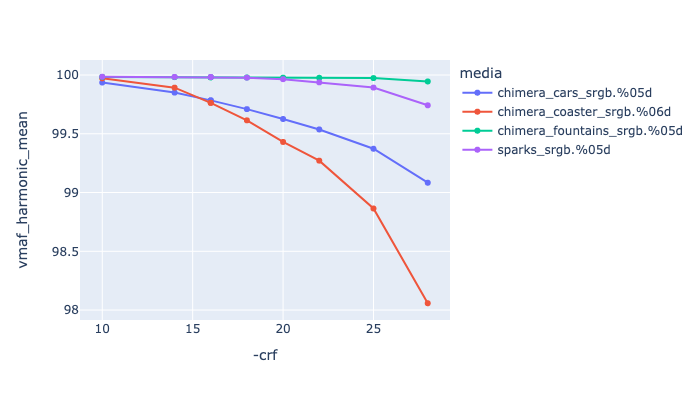

# AV1

AV1 is an open-source and royalty free codec developed by the [Alliance for Open Media](https://en.wikipedia.org/wiki/Alliance_for_Open_Media) (AOMedia), a non-profit industry consortium. It can be 50% higher efficiency than h264. 

The royalty free and open-source features of the codec make it extremely interesting to the VFX community, however most of the codecs are significantly slower than h264, which may be a major hurdle for adoption. Having said that, they are actively being developed, so this could change at some point.

General ffmpeg info on AV1 is [here](https://trac.ffmpeg.org/wiki/Encode/AV1).

AV1 has browser support in:
   * Chrome
   * Edge
   * Firefox
   * Opera
the main missing one is Safari. Apple has now joined the AOM group, and we are starting to see AV1 hardware support in their latest hardware, but currently safari does still not support it.

Outside of the web browser, AV1 support is pretty much limited to Houdini, ffmpeg and VLC.

AV1 is supported by mp4 and webm containers, no support exists for mov.

There are three encoders available via ffmpeg:
* [libsvtav1](#libsvtav1)
* [libaom-av1](#libaom-av1)
* [librav1e](#librav1e)


## Libsvtav1
[SVT-AV1](https://gitlab.com/AOMediaCodec/SVT-AV1) was originally developed by Intel with Netflix. In 2022 it was adopted by AOMedia as the basis of future development for AV1.
It has a more limited support for pix-formats currently only supporting: yuv420p yuv420p10le

Supported pixel formats: yuv420p yuv420p10le

Example encoding:

<!---
name: test_libsvtav1
sources: 
- sourceimages/chip-chart-1080-16bit-noicc.png.yml
comparisontest:
   - testtype: idiff
     compare_image: ../sourceimages/chip-chart-1080-16bit-noicc-yuv420p10le.png
   - testtype: assertresults
     tests:
     - assert: less
       value: max_error
       less: 0.00195
-->
```
ffmpeg -r 24 -start_number 1 -i inputfile.%04d.png -frames:v 200 -c:v libsvtav1 \
        -pix_fmt yuv420p10le -crf 18 -preset 9  -svtav1-params tune=0 -sws_flags lanczos \
        -vf "scale=in_range=full:in_color_matrix=bt709:out_range=tv:out_color_matrix=bt709" \
        -color_range tv -colorspace bt709 -color_primaries bt709 -color_trc iec61966-2-1\
        -y outputfile.mp4
```

| --- | --- |
| **-crf 18** | This is the constant rate factor, controlling the default quality in the range 0-63. By default this is set to 50, which is a little on the low side, using values closer to 18 is recommended, but this does come at the expense of file-size. For more on this see the [CRF comparison](#crf-comparison-for-libsvtav1) below. |
| **-preset 9** | Help with a trade-off between encoding speed and compression efficiency. Supported preset range in the 0-13. See below for comparisons |

See also: 
   * [SVT-AV1 ffmpeg](https://gitlab.com/AOMediaCodec/SVT-AV1/-/blob/master/Docs/Ffmpeg.md)
   * [SVT-AV1 arguments](https://gitlab.com/AOMediaCodec/SVT-AV1/-/blob/master/Docs/Parameters.md)
   * [SVT-AV1 Common Args](https://gitlab.com/AOMediaCodec/SVT-AV1/-/blob/master/Docs/CommonQuestions.md)

### CRF Comparison for libsvtav1

To help pick appropriate values with the CRF flag, we have run the [Test Framework](enctests/README.html) through some of the [reference media](enctests/sources/enc_sources/README.html).

|   This is showing CRF values against encoding time. |
|  This is showing CRF values against file size. |
|  This is showing CRF values against VMAF harmonic mean |


### Preset values for libsvtav1

See: [SVT-AV1 Common Questions](https://gitlab.com/AOMediaCodec/SVT-AV1/-/blob/master/Docs/CommonQuestions.md)


See Also: 
   * [svt-av1 encoder user guide](https://gitlab.com/AOMediaCodec/SVT-AV1/-/blob/master/Docs/svt-av1_encoder_user_guide.md)
   * [ffmpeg svt-av1](https://gitlab.com/AOMediaCodec/SVT-AV1/-/blob/master/Docs/Ffmpeg.md)

## libaom-av1

This is the reference encoder [AOM Media Codec](https://github.com/AOMediaCodec/community/wiki)

Supported pixel formats:
yuv420p yuv422p yuv444p gbrp yuv420p10le yuv422p10le yuv444p10le yuv420p12le yuv422p12le yuv444p12le gbrp10le gbrp12le gray gray10le gray12le


Example encoding:

```
ffmpeg -r 24 -start_number 1 -i inputfile.%04d.png -frames:v 200 -c:v libaom-av1  \
        -pix_fmt yuv420p10le -cpu-used 6 -crf 20 -row-mt 1 -sws_flags lanczos \
        -vf "scale=in_range=full:in_color_matrix=bt709:out_range=tv:out_color_matrix=bt709" \
        -color_range tv -colorspace bt709 -color_primaries bt709 -color_trc iec61966-2-1\
        -y outputfile.mp4
```


| --- | --- |
| -cpu-used 6 | This sets how efficient the compression will be. The default is 1, changing this will increase encoding speed at the expense of having some impact on quality and rate control accuracy.  Values above 6 are reset to 6 unless real-time encoding is enabled. See below for comparison. |
| -row-mt 1 | This enables row based multi-threading (see [here](https://trac.ffmpeg.org/wiki/Encode/VP9#rowmt)) which is not enabled by default. |
| -usage allintra | Encodes for all intra-frames  |
| -arnr-strength | This decreases the amount of noise reduction you get, setting it to 1 helps preserve grain, and some noisy pictures |
| -aom-params: tune-content=film | There is a tune parameter, but it just seems to make the picture grainy, and is not recommended | 

Libaom has an aggressive denoiser, which can be pretty good for animated media, but can be a problem for live-action, particularly if there is noisy content, such as water or particles. CRF needs to be lowered to counter this, which does affect encoding speed.

### cpu-speed Comparison for libaom-av1

To help pick appropriate values with the cpu-speed flag, we have run the [Test Framework](enctests/README.html) through one of the test media. You can see that values are 

|   |  |
| This is showing cpu-speed values against encoding time. You can see that values of 1 and 2 are more than 15 minutes, where most other encoders are closer to the 30 second range. | Same graph of cpu-speed value against encoding time a 0-500 scale. This is showing cpu-used 5 is now just twice as slow, as Libsvtav1, but at 422 vs. 420 |

|  This is showing cpu-speed values against file size. |
|  This is showing cpu-speed values against VMAF harmonic mean |


See Also - note these are all guides for AOMENC (the AOM encoder that is part of libaom), but many of the parameters map to ffmpeg:
   * [A 2nd generation guide to aomenc-av1](https://forum.doom9.org/showthread.php?t=183906)
   * [Making aomenc-AV1/libaom-AV1 the best it can be in a sea of uncertainty](https://old.reddit.com/r/AV1/comments/lfheh9/encoder_tuning_part_2_making_aomencav1libaomav1/)
   * [Av1an](https://master-of-zen.github.io/Av1an/Encoders/aomenc.html)
   * [AV1 Codec Wiki](https://wiki.x266.mov/docs/encoders/aomenc)

## librav1e
[librav1e](https://github.com/xiph/rav1e) is the Xiph encoder for AV1, written in rust.

Supported pixel formats:
yuv420p yuvj420p yuv420p10le yuv420p12le yuv422p yuvj422p yuv422p10le yuv422p12le yuv444p yuvj444p yuv444p10le yuv444p12le

There is no CRF flag, so you use the -gp flag, the recommended starting point is about 100. However, we have been unable to get an substantial speed improvement over AOM.
