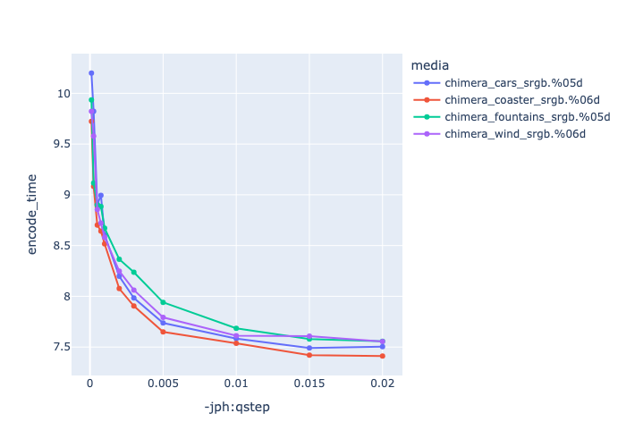
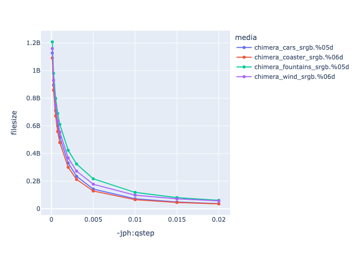
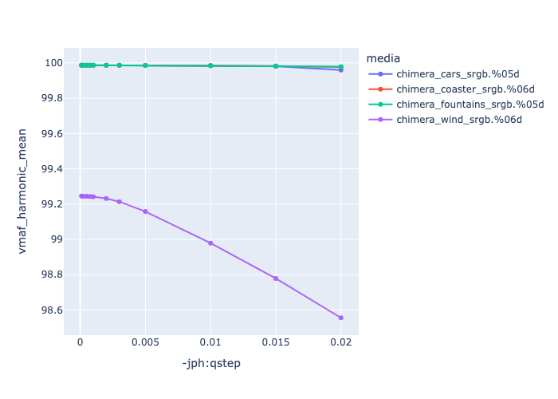
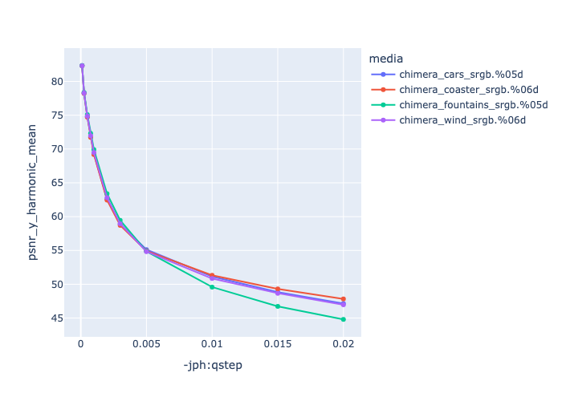

# HTJ2K - High Throughput JPEG 2000

HTJ2K is an extremely interesting extension of the JPEG-2000 standard that is widely used in digital cinema, which promises significantly faster encoding and decoding for a small hit to compression efficiency. 

The key advantages of HTJ2K include:

1. Visually lossless compression with high throughput.   
2. 10x-30x faster than Jpeg2000.  
3. Resolution scalability, lower resolutions extracted without needing to fully decode the file.  
4. Frame-based (intra-frame) compression. Each frame is encoded independently, which is ideal for random-access playback and scrubbing. Since each frame is encoded separately, and then stitched together into a container the compression can easily be parallelized.  
5. Support for 10-16-bit precision, JPEG-2000 can go higher, but many of the tools do not natively support it.  
6. Open-standards and royalty-free - Based on ISO/IEC 15444-15.  
7. GPU support (although not yet open-sourced).  
8. Compression is wavelet based, which for live-action is considered superior to the DCT compression of ProRes.

The Digital Cinema Initiative (DCI) Spec uses the older J2K standard, with:

* 12-bit per color component  
* CIE XYZ color space  
* 250 Mbit/s regardless of whether its 2k (2048x1080) or 4k (4096x2160) 24 fps.  
* 500Mbit/s for [high-frame rate](https://www.dcimovies.com/recommended-practice) (60/96/120 fps)

The rate control has limited support in the open-source tools.

[HTJ2K](https://lists.aswf.io/g/openexr-dev/attachment/5389/0/openexr+ht-v10.pdf) is now available in OpenEXR as a lossless compression option, which offers better compression sizes and faster encoding and decoding than PIZ. This is an example of HTJ2K usage with floating point, which is supported by the format, but not widely used.

See - 

* [https://github.com/chafey/HTJ2KResources](https://github.com/chafey/HTJ2KResources)  
* [https://htj2k.com/](https://htj2k.com/)  
* [HTJ2K Discord Server](https://discord.gg/U4Zbq7RGDn)

## File Extensions

Typically the intermediate HTJ2K file uses a J2C extension. Wrapping the resulting image sequence into a MXF or MOV file allows you to store any metadata in those file-formats.

There are not many options for additional metadata in j2c files, other than a comment parameter.  

## HTJ2K Encoding

HTJ2K can be encoded with BlackMagic Resolve which is using Kakadu. Other open source encoders include -

* [https://github.com/aous72/OpenJPH](https://github.com/aous72/OpenJPH)  
  * Up to 16-bit. (see below), includes SSE3 and AVX512 acceleration.  
* [https://github.com/osamu620/OpenHTJ2K](https://github.com/osamu620/OpenHTJ2K)  
  * Up to 12 bit only, does include QFactor (see below).  
* [https://github.com/GrokImageCompression/grok](https://github.com/GrokImageCompression/grok)  
  * Fork of OpenJPEG does include some rate control.

The above are all per frame encoders, see below for [oiiotool](#openimageio-htj2k) integration which can handle image sequences.

Commercial Decoders

* [https://comprimato.com/products/comprimato-jpeg2000/](https://comprimato.com/products/comprimato-jpeg2000/) (GPU and software)  
* [https://kakadusoftware.com/toolkit/kakadu-ht/](https://kakadusoftware.com/toolkit/kakadu-ht/) (GPU and software)  
* [https://docs.nvidia.com/cuda/nvjpeg2000/index.html](https://docs.nvidia.com/cuda/nvjpeg2000/index.html) (GPU)

### OpenJPH - ojph_compress

Ojph_compress is part of the OpenJPH library. It can read pgm, ppm, pfm, dpx, tif and raw files, and generate j2c compressed files. But it can only do a single frame at a time.

An example:  
```
ojph_compress -i INPUTFRAME.0001.tif -o OUTPUTFRAME.0001.j2c -qstep 0.001 
```

### OpenImageIO HTJ2K

[OpenImageIO](https://openimageio.readthedocs.io/en/latest/oiiotool.html) has been updated to support HTJ2K, using the OpenJPH library. OpenJPH does need to be already built and pkg-config needs to be able to find it. Currently it is merged with the main branch, but there is not a release for it (should be later this year).  
The advantage of using OIIO over ojph_compress are:

* Colorspace conversion rather than requiring an additional step.  
* Built in batch-conversion.  
* More options for image source, including OpenEXR.

Creating HTJ2K files can be done on the command line with oiiotool, e.g.:  
```
oiiotool -t STARTFRAME-ENDFRAME –parallel-frames -i INPUTFRAMESEQ.%05d.tif \
     –compression htj2k --attrib jph:qstep 0.001 -o OUTPUTFRAMESEQ.%05d.j2c
```
Without the jph:qstep flag, lossless mode is used, which is typically quite a bit smaller than many other compression schemes, but not typically small enough for reviews.

| *–attrib jph:qstep 0.0001* | Interval size used to quantize wavelet coefficients. There is a rough mapping between this and the meaningful bit-depth of the resulting picture, qstep \= 2^(- bit-depth)   If this is not defined, lossless compression is used. (See below). |
| *–attrib jph:block_size 64,64* | The older JPEG2000 standard used to default to 32,32 but this does seem to result in a smaller file, this is the default for OIIO. |
| *–attrib jph:prog_order RPCL* | (see [below](#progression-order)). |

While JPEG2000 can support YCrCb this openimageio implementation assumes that we are only generating RGB results.

### HTJ2K Wrapping J2C files in container

There are a number of advantages to having the J2C files in a container:

* Easier to transport a single file, rather than an image sequence.  
* Allows additional metadata to be stored in the container header.  
* In some cases seek time could be improved with the right container by creating an index table to seek into the container faster, although this may require additional development to support it.

FFMPEG provides the ability to add j2c files to a container with the following command:  
```
ffmpeg -f image2 -r 24 -i JPEGFILES.%05d.j2c -vcodec copy outputfile.mov
```

### Encoding Guidelines Benchmarks

Below are some charts showing how different qstep values affect, encode time, file-size and quality.

|   This is showing Qstep values against encoding time. |
|  This is showing Qstep values against file size. |
|  This is showing Qstep values against VMAF harmonic mean |
|  This is showing Qstep values against PSNR |

NOTE - qstep default = 1/(2^bit-depth) so default for above 8-bit 0.00390625, 10-bit image would be 0.000976562 and 12-bits it would need to be 0.000244. So you really want to have at least a value of .002 or less. 

So we probably want something close to or below 0.001 as a starting value for 10-bit data or at least between 0.001 and 0.003.

## QFactor

As an alternative to setting the qstep, with the [https://github.com/osamu620/OpenHTJ2K](https://github.com/osamu620/OpenHTJ2K) encoder you also have the option of setting the quality with a [QFactor](https://ds.jpeg.org/documents/jpeg2000/wg1n100430-098-COM-Guideline_on_controlling_JPEG_2000_image_quality_using_a_single_parameter.pdf) flag. This is closer to the Jpeg 0-100 quality flag. It is also a little more refined than setting qstep allowing it to use different qsteps for different sub-bands of the image. 

In testing it with OpenHTJ2K and it does feel nicer than the fractional qstep. However, for our needs we typically would want something between 99 and 100.

|   This is showing QFactor values against encoding time. |
|  This is showing QFactor values against file size. |
|  This is showing QFactor values against VMAF harmonic mean |
|  This is showing QFactor values against psnr y harmonic mean |

See  - [Controlling JPEG 2000 image quality using a single parameter (Qfactor)](https://ds.jpeg.org/documents/jpeg2000/wg1n100430-098-COM-Guideline_on_controlling_JPEG_2000_image_quality_using_a_single_parameter.pdf) for more info.

## Progression Order {#progression-order}

The progression order (typically a prog_order flag in openjph, or jph:prog_order  
 In OIIO) defines how the compressed image data is organized in the code-stream. 

| Flag | Meaning | When to use it |
| :---- | :---- | :---- |
| LRCP | Layer -\> Resolution -\> Component -\> Position | Good for progressive quality over full image, particularly useful if you have multiple layers (not currently supported by OIIO). |
| RLCP | Resolution -\> Layer -\> Component -\> Position | Prioritizes lower resolutions first, allows you to load all of the layers at a lower resolution and then  |
| RPCL | Resolution -\> Position -\> Component -\> Layer | Optimized for random access and tiling. |
| PCRL | Position -\> Component -\> Resolution -\> Layer | Less common, spatial prioritisation, good for large images where you are viewing zoomed in sections of it. |
| CPRL | Component -\> Position -\> Resolution -\> Layer | Used when components are needed separately, e.g. YUV where you might just want Y first, rarely used in VFX. |

Of these settings picking either RPCL or LRCP are the two most common progression orders. OIIO does not currently support layers, so really LRCP and RLCP are very similar.

For many cases position can be ignored, unless you start generating particularly large images where you are only interested in part of that large picture. For example having a 360-video where you are only viewing part of the overall picture. This may be where you would also want to tweak the precincts parameters of the codec. This is definately an area that JPEG2000 comes into its own, since

## HTJ2K Decoding and Playback

HTJ2K decoding has already been included in the OpenJpeg 2.5 library, which is widely used by ffmpeg and OIIO. However it is using a slower older version of the code that became OpenJPH, so is not suitable for playback. Similarly, ffmpeg has its own decoder that can read htj2k files, but does not have the throughput that OpenJPH has.

Playback is somewhat limited, but [OpenRV](https://github.com/AcademySoftwareFoundation/OpenRV) recently added HTJ2K support both as image sequences of J2C files, as well as wrapped in MXF, MOV or MP4 containers.

The tests below are with OpenRV 3.0 configured with 12 threads and a 4GB buffer.  
The test was to pick a frame rate where openRV is able to load a buffer at a rate sufficient to play long image sequences without stuttering or pausing (i.e. it can load the cache at least as fast as the playback).

|  | M2 MAX Macbook Pro | Intel I9-Windows |
| :---- | :---- | :---- |
| HTJ2K qstep=0.0009 4K |  35 fps |  |
| HTJ2K qstep=0.001 4K | 35 fps | 43 fps |
| HTJ2K qstep=0.002 8K | 6 fps | 11 fps |
| HTJ2K qstep=0.002 8K loading 4K resolution | 40 fps |  |

Note, the higher performance on windows is from the additional optimization on windows hardware, having said that the performance for 4k playback is acceptable for cinema content and does have quite a bit of optimization compared to OpenJPEG and FFMPEG.  
It's also worth pointing out that improved playback performance can be achieved using [Kakadu](https://kakadusoftware.com/) and [Comprimato](https://comprimato.com/) commercial decoders, although pure GPU based ones may not perform too well within openRV.

[Blackmagic Resolve](https://www.blackmagicdesign.com/uk/products/davinciresolve) can also playback HTJ2K J2C image sequence files. It does not appear to be able to recognise J2C files in containers though. 

## Future work

* Adding HTJ2K to other players such as XStudio  
* Adding resolution control to be able to load ½ and ¼ resolution images from the source.  
* Auto switching resolutions based on playback performance.  
* Floating point support, and HDR support. (Good to get feedback on this).  
* Being able to load HTJ2K files from a S3 bucket, contained in a MXF file.

