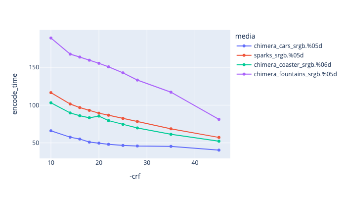
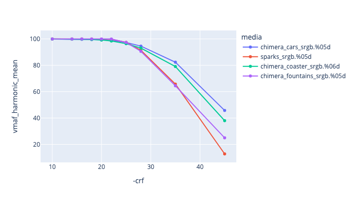

# HEVC/H.265 Encoding

*This is under development*

H.265 (High Efficiency Video Compression - HEVC) is one of the replacements for H.264. It allows for a reduction of file size compared to H.264 of 25-50% and supports frame formats up to 8K (UHDTV). It also has support for HDR, which we go into more [here](enctests/HDR_Encoding.md).

There is Browser support for H265 on Microsoft Edge, Google Chrome and Safari, but not Firefox.

See [ffmpeg h265 docs](https://trac.ffmpeg.org/wiki/Encode/H.265)

There are four HEVC encoders available to ffmpeg:
   * [libx265](libx265)
   * [hevc_videotoolbox](#hevc_videotoolbox) - Available on OSX via the videotoolbox library.
   * [hevc_nvenc](#hevc_nvenc) - NVIDIA GPU encoder.
   * hevc_qsv - Intel Quick Sync Video Acceleration.

## libx265

Supported pixel formats: 
yuv420p
yuvj420p
yuv422p
yuv422p10
yuv444p10le
gbrp10le
gbrp12le
gbrp

Example encoding:

<!---
name: test_h265
sources: 
- sourceimages/chip-chart-1080-16bit-noicc.png.yml
comparisontest:
   - testtype: idiff
     compare_image: ../sourceimages/chip-chart-1080-16bit-noicc-yuv420p10le.png
   - testtype: assertresults
     tests:
     - assert: less
       value: max_error
       less: 0.00195
-->
```
ffmpeg -r 24 -start_number 1 -i inputfile.%04d.png -frames:v 200 -c:v libx265 \
    -pix_fmt yuv420p10le -crf 22 -preset slow -sws_flags spline+accurate_rnd+full_chroma_int \
    -vf "scale=in_range=full:in_color_matrix=bt709:out_range=tv:out_color_matrix=bt709" \
    -color_range 1 -colorspace 1 -color_primaries 1 -color_trc 2 -y outputfile.mp4
```


| -- | -- |
| -preset medium | Can be one of ultrafast, superfast, verfast, faster, fast, medium, slow, slower, and placebo |
| -crf 22 | Similar to h264, default is 28, but should be similar to crf 22 |
| -x265-params lossless=1 | Does lossless encoding, -crf 0 is not required |
| -tag:v hvc1 | To make it "Apple "Industry standard" compliant |
| -profile main | Profile can be one of main or main10 or main12 |

## libx265 crf values

To help pick appropriate values with the CRF flag, we have run the [Test Framework](enctests/README.html) through some of the [reference media](enctests/sources/enc_sources/README.html).

If you are trying to map crf values from h264, [VS_Fan](http://forum.doom9.net/showthread.php?p=1940750) came up with the following remapping formula:
```
x265_crf(x264_crf) = 1.09 * x264_crf −  4.19
```

|   This is showing CRF values against encoding time. |
|  This is showing CRF values against file size. |
|  This is showing CRF values against VMAF harmonic mean |

## libx265 preset comparisons

Below is showing a comparison of different preset values with a crf value of 18.
Its showing that you really can just encode with -preset medium or -preset slow anything higher is really not gaining you anything.

|   This is showing CRF values against encoding time. |
|  This is showing CRF values against file size. |
|  This is showing CRF values against VMAF harmonic mean |


## hevc_videotoolbox

Supported pixel formats: 
bgra
p010le
nv12

## hevc_nvenc

https://gist.github.com/jbboehr/f487b659cac086b176703c718d797f3b
https://superuser.com/questions/1296374/best-settings-for-ffmpeg-with-nvenc


