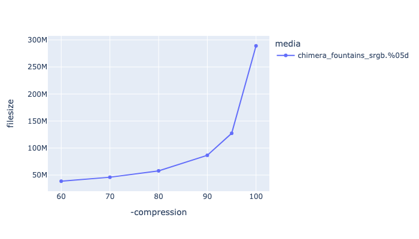

# MJPEG - Motion JPEG

[Motion JPEG](https://en.wikipedia.org/wiki/Motion_JPEG) has historically been quite common in the VFX industry, and is part of the default Quicktime codecs, so is well supported on players, although not typically supported in web browsers.

While it does compress quickly, and maintains its quality fairly well, we would recommend other codecs at higher bit-depths such as vp9, h264 or h265 (or even Prores or DNxHD), which will also compress better than mjpeg.

## MJPEG

mjpeg has a limited range of pixel formats:
yuvj420p yuvj422p yuvj444p yuv420p yuv422p yuv444p


Example encoding:

<!---
name: test_mjpeg
sources: 
- sourceimages/chip-chart-1080-16bit-noicc.png.yml
comparisontest:
   - testtype: idiff
   - testtype: assertresults
     tests:
     - assert: less
       value: max_error
       less: 0.00195
-->
```
ffmpeg -r 24 -start_number 1 -i inputfile.%04d.png -frames:v 200 \
   -c:v mjpeg -qscale:v 2  outputfile.mov

```


## Recommended Flags

| --- | --- |
| **-qscale:v 2** | This is the compression factor, which goes from 2 to 31 where 2 is the best quality. See alternative approach for better encoding. |


### qscale:v Comparison

Below is a comparison of different Qscale rates

|   This is showing qscale:v values against encoding time. |
|  This is showing qscale:v values against file size. |
|  This is showing qscale:v values against VMAF harmonic mean |
|  This is showing qscale:v values against PSNR-Y harmonic mean |

## Alternative approach

You can generate the individual jpeg files using another tool, and then use ffmpeg to stitch them together. For example, to convert a series of png frames to jpeg, you can use oiiotool:
```
oiiotool -v --parallel-frames -i PNGFILES.%05d.png --compression jpeg:95 -o JPEGFILES.%05d.jpg
```
and then stitch them together with:
```
ffmpeg -f image2 -r 24 -i JPEGFILES.%05d.jpg -vcodec copy outputfile.mov
```

This gives you more fine grain control over the quality setting, although it gives you less control over the jpeg compression, since it will always be YUV420, where you do get more control with ffmpeg.
Its actually hard to get an exact mapping between the ffmpeg -qscale setting and the jpeg quality. The highest ffmpeg setting is 2, and that roughly maps to a jpeg quality setting of 86%.
So if you require higher quality than 86% then use this approach. Settings below 95% do produce artifacts, so this is the recommended approach if you *have* to do this, a 10-bit encoder would be better though.

Below shows a comparison of jpeg compression to filesize for a HD sized image sequence of 200 frames.

