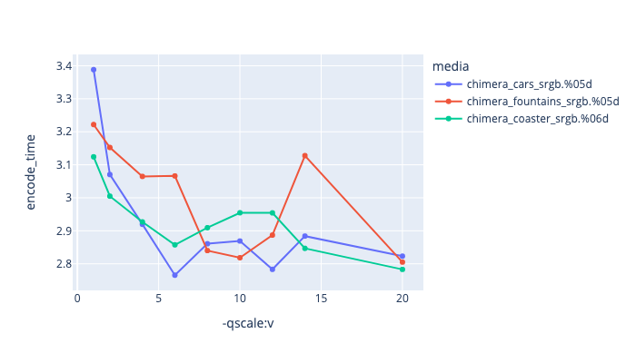
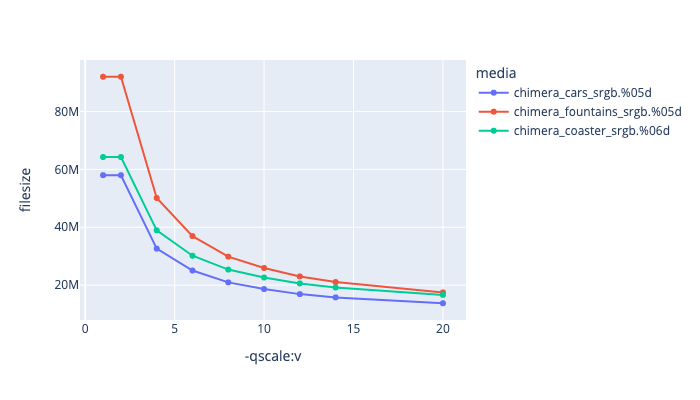
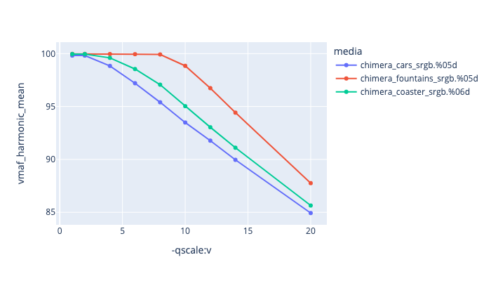
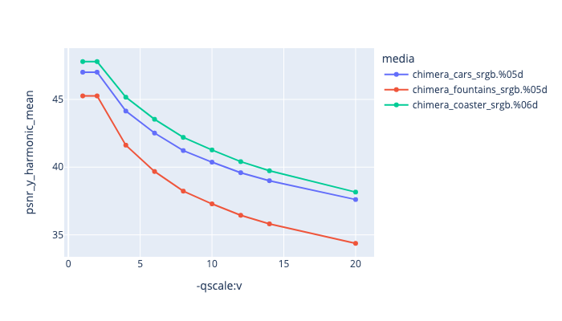

# MJPEG - Motion JPEG

[Motion JPEG](https://en.wikipedia.org/wiki/Motion_JPEG) has historically been quite common in the VFX industry, and is part of the default quicktime codecs, so is well supported on players, although not typically supported in web browsers.

While it does compress quickly, and maintains its quality fairly well, we would recommend other codecs at higher bit-depths such as vp9, h264 or h265 (or even Prores or DNxHD), which will also compress better than mjpeg.


## MJPEG

mjpeg has a limited range of pixel formats:
yuvj420p yuvj422p yuvj444p yuv420p yuv422p yuv444p


Example encoding:

<!---
name: test_mjpeg
sources: 
- sourceimages/chip-chart-1080-16bit-noicc.png.yml
comparisontest:
   - testtype: idiff
   - testtype: assertresults
     tests:
     - assert: less
       value: max_error
       less: 0.00195
-->
```
ffmpeg -r 24 -start_number 1 -i inputfile.%04d.png -frames:v 200 \
   -c:v mjpeg -qscale:v 4  outputfile.mov

```


## Recomended Flags

| --- | --- |
| **-qscale:v 3** | This is the compression factor, which goes from 2 to 31 where 2 is the best quality. |


### qscale:v Comparison

Below is a comparison of different Qscale rates

|   This is showing qscale:v values against encoding time. |
|  This is showing qscale:v values against file size. |
|  This is showing qscale:v values against VMAF harmonic mean |
|  This is showing qscale:v values against PSNR-Y harmonic mean |
