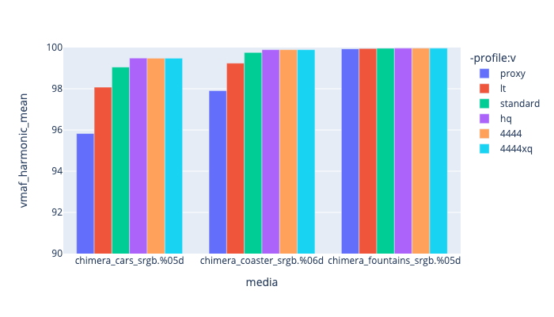

# ProRes <a name="prores"></a>
There are four ProRes encoders, Prores, Prores_ks, Prores_aw and prores_videotoolbox, which is a hardware based OSX M1 encoder/decoder (ffmpeg version 5 or higher).

From [https://trac.ffmpeg.org/wiki/Encode/VFX](https://trac.ffmpeg.org/wiki/Encode/VFX) the recommendation is to use Prores_ks with -profile:v 3 and the qscale of 11 unless you are on OSX where we would recommend using prores_videotoolbox. 

The two encoders we are reviewing are:
* [Prores_ks](#Prores_ks)
* [videotoolbox_prores](#videotoolbox_prores) - only available on osx.

## Prores_ks

While ProRes does support up to 12 bits of resolution, prores_ks can only encode to 10-bits. It is able to decode to > 10 bits (see [https://github.com/ColorlabMD/Prores-BitDepth](https://github.com/ColorlabMD/Prores-BitDepth) )

Supported pixel formats: yuv422p10le yuv444p10le yuva444p10le


Example encode would look like:

<!---
name: test_proresks
sources: 
- sourceimages/smptehdbars_10.dpx.yml
comparisontest:
   - testtype: idiff
     compare_image: ../sourceimages/smptehdbars_10_yuv422p10le.png
     extracttemplate: "ffmpeg -y -i {newfile} -compression_level 10 -pred mixed -pix_fmt rgb48be  -frames:v 1 -vf scale=in_color_matrix=bt709:out_color_matrix=bt709 -sws_flags lanczos+accurate_rnd+full_chroma_int {newpngfile}"
   - testtype: assertresults
     tests:
     - assert: less
       value: max_error
       less: 0.00195
-->
```console
ffmpeg -r 24 -start_number 100 -i inputfile.%04d.png \
         -pix_fmt yuv422p10le -vf "scale=in_color_matrix=bt709:out_color_matrix=bt709" \
        -frames:v 100 -c:v prores_ks -profile:v 3 -vendor apl0  -qscale:v: 10 \
        -color_range tv -colorspace bt709 -color_primaries bt709 -color_trc iec61966-2-1 \
        -y outputfile.mov
```

Options that can be used include:

| --- | --- |
| -profile:v 4444xq | Which ProRes encoding profile to use, see below |
| -qscale:v 3 | between values of 1-6 give a good result, 0 being default, see below for some wedge tests. |
| -vendor apl0 | tricks the codec into believing its from an Apple codec. |
| -alpha_bits 16 | Allows you to specify how many bits to use for the alpha channel (default 16) |


Using this with the usual color space flags, seems to work well with the exception of ffmpeg itself is unable to read a ProRes file, and convert it to a still frame. It needs the flags:`-vf scale=in_color_matrix=bt709:out_color_matrix=bt709` added to the command to ensure the right input colorspace is recognized, e.g.:


```console
ffmpeg -i INPUTFILE.mov -compression_level 10 -pred mixed -pix_fmt rgba64be \
   -sws_flags spline+accurate_rnd+full_chroma_int -vframes 1 \
   -vf scale=in_color_matrix=bt709:out_color_matrix=bt709 OUTPUTFILE.png
```

However, other encoders seem to be recognized correctly, so there is clearly some metadata missing. I did try using the prores_metadata filter to try adding some additional parameters, but it didn't seem to help.

```console
ffmpeg -i ./chip-chart-yuvconvert/basicnclc.mov -c copy \
   -bsf:v prores_metadata=color_primaries=bt709:color_trc=bt709:colorspace=bt709 \
   chip-chart-yuvconvert/basicnclcmetadata.mov
```
### Prores_ks profile

Profile values can be one of:

| Profile | Number | Chroma | Data Rate HD @ 29.97 | Description |
|:----------|:-----------|:-----------|:-----------|:-----------|
| proxy | 0 | 4:2:2 | 45Mbps | Proxy |
| lt | 1 | 4:2:2 | 102Mbps | Light |
| standard | 2 | 4:2:2 | 147Mbps | Standard |
| hq | 3 | 4:2:2 | 220Mbps | High Quality 10-bit |
| 4444 | 4 | 4:4:4:4 | 300Mbps | High quality mastering format, can support both RGB and Y'CrCb. Also supports a 16-bit mathematically lossless alpha. |
| 4444xq | 5 | 4:4:4:4 | 500MBps | High quality mastering format, supports up to 12 bit, and 16-bit alpha. ffmpeg will only generate up to 10-bit. |

See [https://support.apple.com/en-us/HT202410](https://support.apple.com/en-us/HT202410)

To compare them:

|   This is showing profile values against encoding time. |  This is showing profile values against file size. |
|  This is showing profile values against VMAF harmonic mean (quality)|


### Prores_ks -qscale:v comparison.

To help pick appropriate values with the -qscale:v , we have run the [Test Framework](enctests/README.html) through some of the [reference media](enctests/sources/enc_sources/README.html).

|   This is showing qscale values against encoding time. |
|  This is showing qscale values against file size. |
|  This is showing qscale values against VMAF harmonic mean (quality)|

## videotoolbox_prores

If you are on a OSX M1 machine and are using ffmpeg 5.0 or higher, you can use the built in libraries to encode to ProRes using:

<!---
name: test_prores_videotoolbox
sources: 
- sourceimages/smptehdbars_10.dpx.yml
comparisontest:
   - testtype: idiff
     compare_image: ../sourceimages/smptehdbars_10_yuv422p10le.png
     extracttemplate: "ffmpeg -y -i {newfile} -compression_level 10 -pred mixed -pix_fmt rgb48be  -frames:v 1 -vf scale=in_color_matrix=bt709:out_color_matrix=bt709 -sws_flags spline+accurate_rnd+full_chroma_int {newpngfile}"
   - testtype: assertresults
     tests:
     - assert: less
       value: max_error
       less: 0.00195
-->
```console
ffmpeg -r 24 -start_number 1 -i inputfile.%04d.png  \
         -pix_fmt yuv422p10le \
        -vf "scale=in_color_matrix=bt709:out_color_matrix=bt709" \
        -vframes 100 -c:v prores_videotoolbox -profile:v 3  \
        -color_range tv -colorspace bt709 -color_primaries bt709 -color_trc bt709 outputfile.mov

```

NOTE, it does not appear to allow `-color_trc iec61966-2-1` (sRGB) -- so this needs more testing.

### Prores_videotoolbox profile

Similar to prores_ks, with the exception of xq. Profile values can be one of:

| Profile | Number | Chroma | Data Rate HD @ 29.97 | Description |
|:----------|:-----------|:-----------|:-----------|:-----------|
| proxy | 0 | 4:2:2 | 45Mbps | Proxy |
| lt | 1 | 4:2:2 | 102Mbps | Light |
| standard | 2 | 4:2:2 | 147Mbps | Standard |
| hq | 3 | 4:2:2 | 220Mbps | High Quality 10-bit |
| 4444 | 4 | 4:4:4:4 | 300Mbps | High quality mastering format, can support both RGB and Y'CrCb. Also supports a 16-bit mathematically lossless alpha. |
| xq | 5 | 4:4:4:4 | 500MBps | High quality mastering format, supports up to 12 bit, and 16-bit alpha. ffmpeg will only generate up to 10-bit. |
