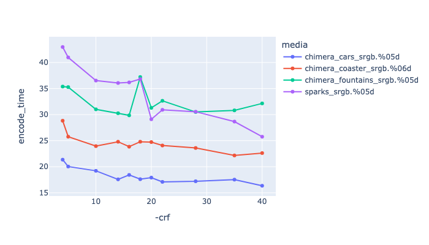
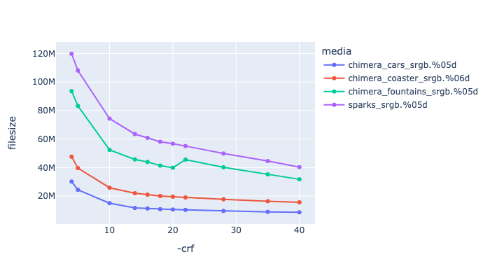
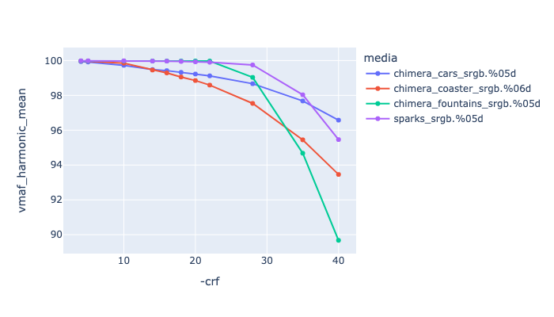
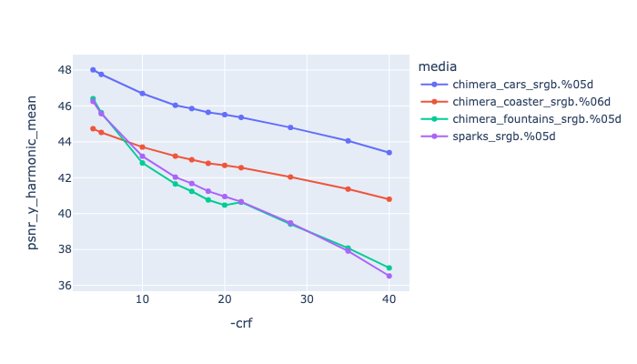
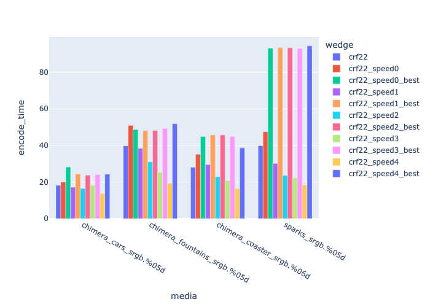
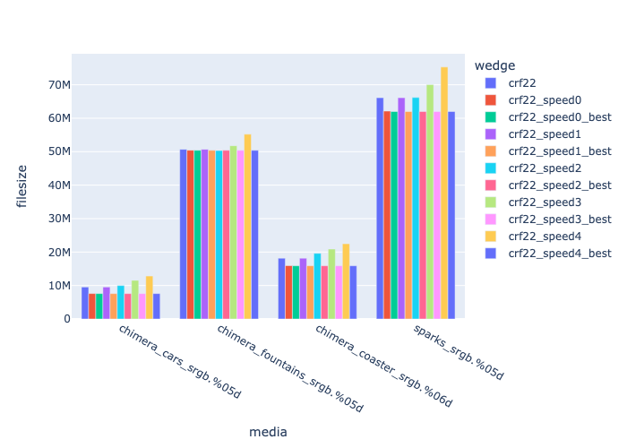
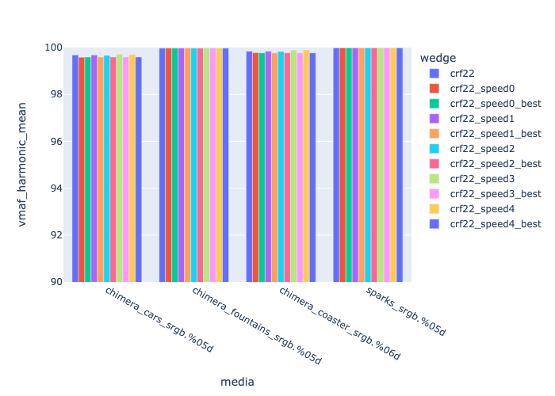
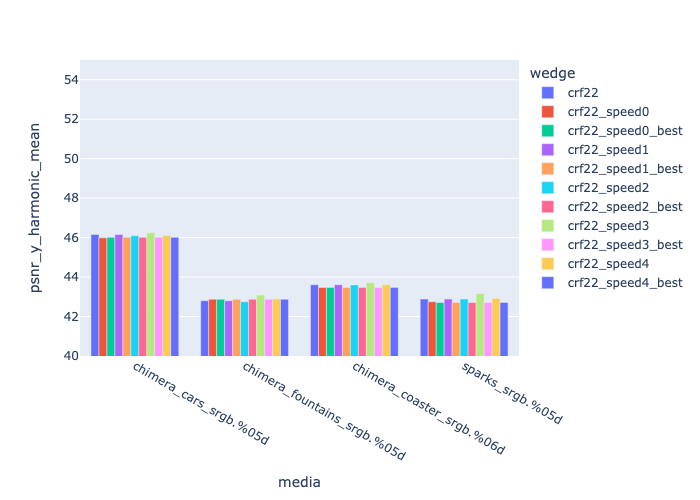

# VP8

VP8 is an open-source and royalty free codec developed by the [Alliance for Open Media](https://trac.ffmpeg.org/wiki/Encode/VP8) (AOMedia), a non-profit industry consortium. It will only encode to 8-bit 4:2:0 using the webm container. It is possible to get a similar quality to h264, but not typically at the same compression ratio. It is recommended that you consider [VP9](EncodeVP9.html) which is a considerably better codec. VP8 does support an alpha channel (via the yuva420p pixfmt).

General ffmpeg info on VP8 is [here](https://trac.ffmpeg.org/wiki/Encode/VP8), and on the encoder in general [https://www.webmproject.org/docs/encoder-parameters/](https://www.webmproject.org/docs/encoder-parameters/).

VP8 has browser support in:
   * Chrome.
   * Edge
   * Firefox
   * Opera

VP8 is supported by mkv and webm containers, no support exists for mov or mp4.

## libvpx

libvpx has a limited range of pixel formats:
yuv420p yuva420p


Example encoding:

<!---
name: test_vp8
sources: 
- sourceimages/chip-chart-1080-16bit-noicc.png.yml
comparisontest:
   - testtype: idiff
     compare_image: ../sourceimages/chip-chart-1080-16bit-noicc-yuv420p10le.png
   - testtype: assertresults
     tests:
     - assert: less
       value: max_error
       less: 0.00195
-->
```
ffmpeg -r 24 -start_number 1 -i inputfile.%04d.png -frames:v 200 \
    -c:v libvpx -crf 20 -b:v 200M -pix_fmt yuv420p \
    -qmin 0 -qmax 50 -quality good -speed 4 \
   -sws_flags spline+accurate_rnd+full_chroma_int \
   -vf "scale=in_range=full:in_color_matrix=bt709:out_range=tv:out_color_matrix=bt709" \
   -color_range tv -colorspace bt709 -color_primaries bt709 -color_trc iec61966-2-1  \
     -y outputfile.webm
```


## Recommended Flags

```
-crf 20 -quality good -b:v 200M  -speed 4  
```

| --- | --- |
| **-crf 20** | This is the constant quality rate factor, controlling the default quality, similar to h264. The range is a little different to h264, so you may need to test. |
| *-quality good* | May require additional testing, but so far switching to *-quality best* increased the duration, but didn't increase the VMAF score (which is already pretty high with these values of crf). |
| -b:v 200M | Unlike with h264, and vp9 you need to set the bit rate, but you can set it to a high number, and this is the max it would be. |
| -speed 4 | It sets how efficient the compression will be. Unless you are using -quality best, this doesnt seem to have a setting for  |

Its possible you might want to change the [GOP](https://aws.amazon.com/blogs/media/part-1-back-to-basics-gops-explained/#:~:text=Simply%20put%2C%20a%20GOP%20is,30%20frames%2C%20or%201%20second.) values (changed with the -g flag), since the default is 240 frames. 


### CRF Comparison

Below is a comparison of different CRF rates, with -b:v 200M and -quality good


|   This is showing CRF values against encoding time. |
|  This is showing CRF values against file size. |
|  This is showing CRF values against VMAF harmonic mean |
|  This is showing CRF values against psnr y harmonic mean |

### Speed Comparison

Below is a comparison of different speed rates, -quality good vs. -quality best and with -crf 22, -b:v 200M.

This shows that with -quality good the filesize doesnt vary, but with increasing speed settings the encoding time goes down. 

|   This is showing speed against encoding time. |
|  This is showing speed values against file size. |
|  This is showing speed values against VMAF harmonic mean |
|  This is showing speed values against psnr y harmonic mean |
