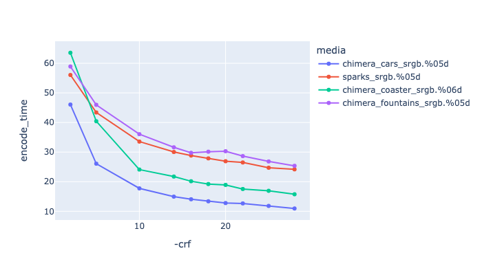
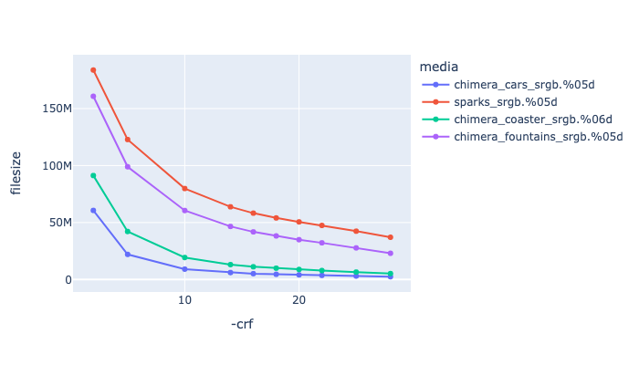
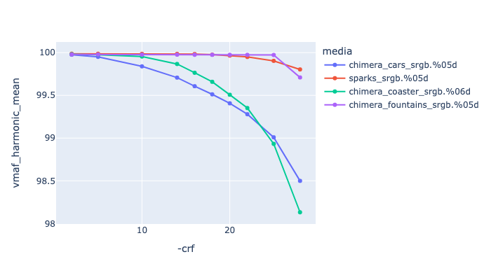
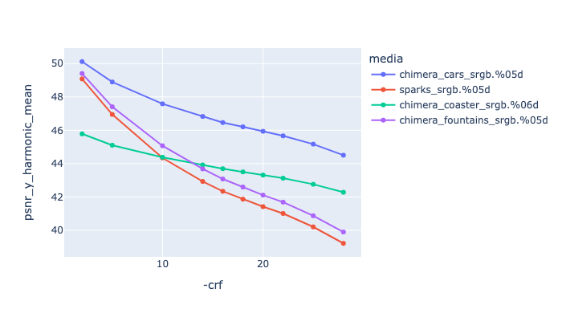
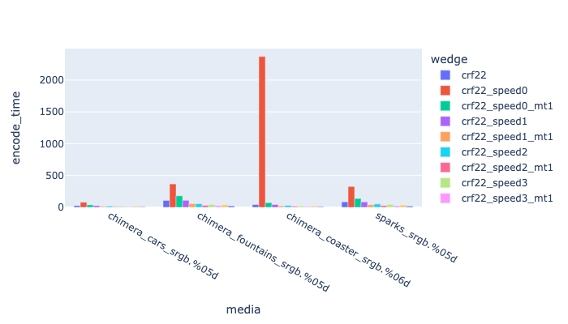
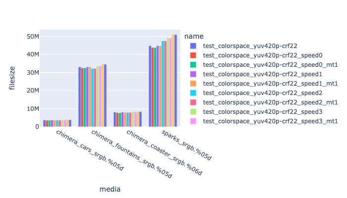
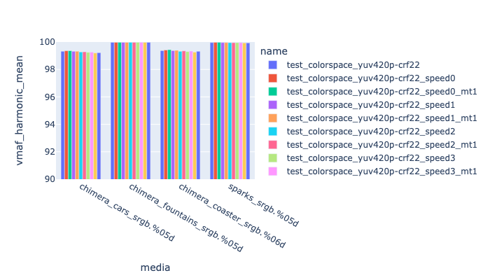
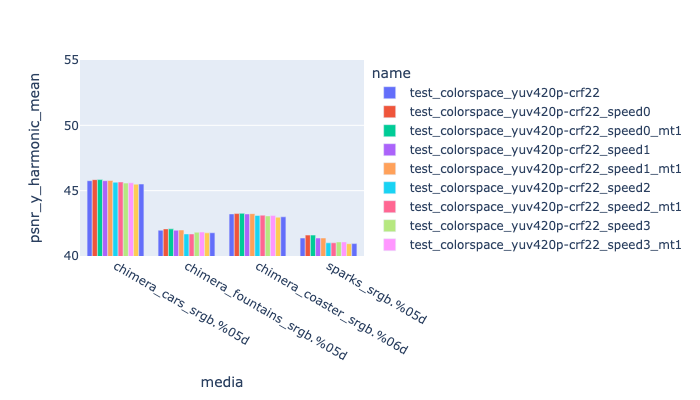

# VP9

VP9 is an open-source and royalty free codec developed by the [Alliance for Open Media](https://trac.ffmpeg.org/wiki/Encode/VP9) (AOMedia), a non-profit industry consortium. It can be 20-50% higher efficiency than h264. 

General ffmpeg info on VP9 is [here](https://trac.ffmpeg.org/wiki/Encode/VP9), and on the encoder in general [https://developers.google.com/media/vp9/hdr-encoding](https://developers.google.com/media/vp9/hdr-encoding).

VP9 has browser support in:
   * Chrome - works on all configurations.
   * Edge - works on all configurations.
   * Firefox - works for 8-bit and 10-bit but fails with 12-bit.
   * Opera - works on all configurations.
   * Safari - works for 8-bit and 10-bit but fails on 10-bit 444 and 12-bit RGB.

VP9 is supported by mp4 and webm containers, no support exists for mov.
VP9 does support an alpha channel (via the yuva420p pixfmt).

Outside of the web browser, VP9 support is pretty much limited to Davinci Resolve (Mac R/W, windows Read-only), Houdini, Blender, ffmpeg and VLC.

The two codecs we will cover are:
* [libvpx-vp9](#libvpx-vp9)
* vp9-nvenc

## libvpx-vp9

libvpx-vp9 has a wide range of pixel formats:
yuv420p yuva420p yuv422p yuv440p yuv444p yuv420p10le yuv422p10le yuv440p10le yuv444p10le yuv420p12le yuv422p12le yuv440p12le yuv444p12le gbrp gbrp10le gbrp12le


Example encoding:

<!---
name: test_vp9
sources: 
- sourceimages/chip-chart-1080-16bit-noicc.png.yml
comparisontest:
   - testtype: idiff
     compare_image: ../sourceimages/chip-chart-1080-16bit-noicc-yuv420p10le.png
   - testtype: assertresults
     tests:
     - assert: less
       value: max_error
       less: 0.00195
-->
```
ffmpeg -r 24 -start_number 1 -i inputfile.%04d.png -frames:v 200 -c:v libvpx-vp9 \
   -pix_fmt yuv420p10le -crf 22 -speed 2 -row-mt 1 -quality good -b:v 0\
   -sws_flags spline+accurate_rnd+full_chroma_int \
   -vf "scale=in_range=full:in_color_matrix=bt709:out_range=tv:out_color_matrix=bt709" \
   -color_range tv -colorspace bt709 -color_primaries bt709 -color_trc iec61966-2-1  \
     -y outputfile.mp4
```


## Recommended Flags

```
-crf 22 -quality good -b:v 0  -speed 2 -row-mt 1 
```

| --- | --- |
| **-crf 23** | This is the constant quality rate factor, controlling the default quality, similar to h264. The range is a little different to h264, so you may need to test. |
| *-quality good* | May require additional testing, but so far switching to *-quality best* increased the duration, but didn't increase the VMAF score (which is already pretty high with these values of crf). |
| -b:v 0 | Unlike with h264, you can set a constant quality rate factor unless it exceeds a specified bit-rate, if the bit-rate is set to 0, it ignores the bit-rate as a factor. |
| -speed 2 | This is also accessible as -cpu_used, it sets how efficient the compression will be. The default is 0, changing this will increase encoding speed at the expense of having some impact on quality and rate control accuracy. (See below). |
| -row-mt 1 | This enables row based multi-threading (see [here](https://trac.ffmpeg.org/wiki/Encode/VP9#rowmt)) which is not enabled by default. |

Its possible you might want to change the [GOP](https://aws.amazon.com/blogs/media/part-1-back-to-basics-gops-explained/#:~:text=Simply%20put%2C%20a%20GOP%20is,30%20frames%2C%20or%201%20second.) values (changed with the -g flag), since the default is 240 frames. Unlike h264 and h265 VP9 does behave strangely with GOP values less than 10, the closer you get to 1, the longer the encoding takes and the larger the file (which is not true for other codecs). 


### CRF Comparison

Below is a comparison of different CRF rates, with -b:v 0 and -quality good


If you are trying to map crf values from h264, [VS_Fan](http://forum.doom9.net/showthread.php?p=1940750) came up with the following remapping formula:
```
vp9_crf (x264_crf) = 1.98 * x264_crf − 14.46
```


|   This is showing CRF values against encoding time. |
|  This is showing CRF values against file size. |
|  This is showing CRF values against VMAF harmonic mean |
|  This is showing CRF values against psnr y harmonic mean |

### Speed Comparison

Below is a comparison of different speed rates, with and without the -row-mt 1 flag, with -crf 22, -b:v 0 and -quality good.

This shows that the -row-mt flag creates an almost identical result, but can be up to twice as quick (for -speed 0).
Also at least with this crf value, even with speed 4, the quality is still pretty good.

|   This is showing speed against encoding time. |
|  This is showing speed values against file size. |
|  This is showing speed values against VMAF harmonic mean |
|  This is showing speed values against psnr y harmonic mean |
