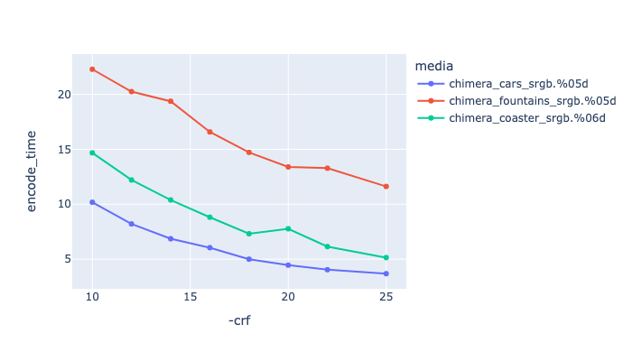
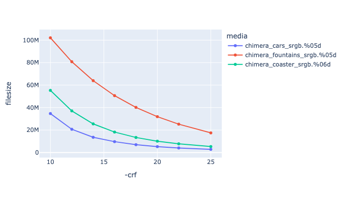
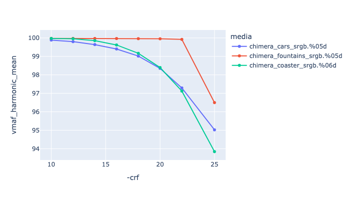
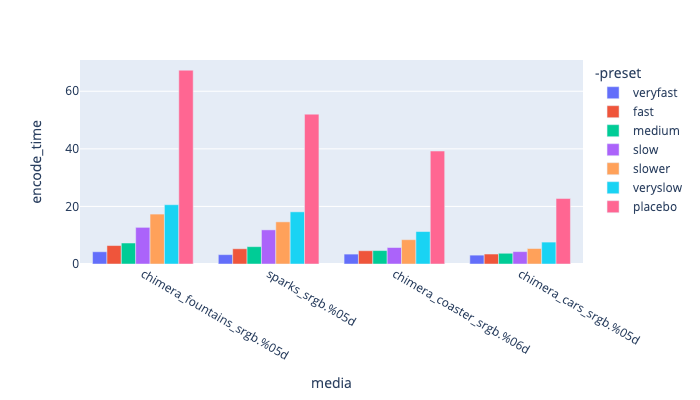
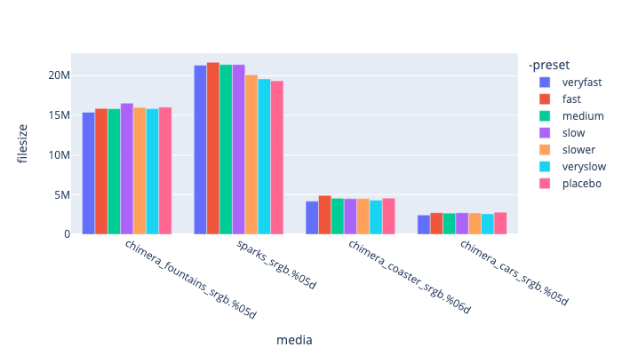
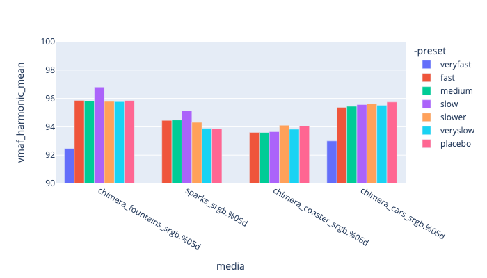

# H264 <a name="h264"></a>

This is the workhorse encoder for web review, its well supported by ffmpeg, and there is a lot of support for both encoding and decoding in hardware.

There are several h264 encoders available:
   * x264 - the videolan h264 open source library.
   * h264_nvenc - the nvidia hardware encoder.
   * videotoolbox_h264 - osx only apple h264 encoder.

## x264

x264 is a library developed by the [videolan association](https://www.videolan.org/developers/x264.html). It has a GPL license.

Supported pixel formats: yuv420p yuvj420p yuv422p yuvj422p yuv444p yuvj444p nv12 nv16 nv21 yuv420p10le yuv422p10le yuv444p10le nv20le gray gray10le

Note, most web browsers only support yuv420p apart from chrome.

Key flags (see [https://trac.ffmpeg.org/wiki/Encode/H.264](https://trac.ffmpeg.org/wiki/Encode/H.264) )

Example encoding:

<!---
name: test_h264
sources: 
- sourceimages/chip-chart-1080-noicc.png.yml
comparisontest:
   - testtype: idiff
     testtemplate: idiff  {originalfile} {newfile}
   - testtype: assertresults
     tests:
     - assert: less
       value: max_error
       less: 0.00195
-->
```
ffmpeg -r 24 -start_number 100 -i inputfile.%04d.png -frames:v 200 -c:v libx264 \
        -pix_fmt yuv420p10le -crf 18 -preset slow \
        -sws_flags spline+accurate_rnd+full_chroma_int \
        -vf "scale=in_range=full:in_color_matrix=bt709:out_range=tv:out_color_matrix=bt709" \
        -color_range 1 -colorspace 1 -color_primaries 1 -color_trc 2 -y outputfile.mp4
```


| --- | --- |
| **-crf 18** | This is the constant rate factor, controlling the default quality (see: [https://slhck.info/video/2017/02/24/crf-guide.html](https://slhck.info/video/2017/02/24/crf-guide.html) ) where -crf 0 is uncompressed. By default this is set to 23, which is a little on the low side, using values closer to 18 is recommended, but this does come at the expense of file-size. For more on this see the [CRF comparison](CRF Comparison) below. |
| **-qp 23** | Quantization Parameter - it is recommended that you do not use this, in preference to -crf above (see: [https://slhck.info/video/2017/03/01/rate-control.html](https://slhck.info/video/2017/03/01/rate-control.html) ) |
| **-preset slow** | [https://trac.ffmpeg.org/wiki/Encode/H.264#FAQ](https://trac.ffmpeg.org/wiki/Encode/H.264#FAQ) |
| **-qscale:v 9** | Generic quality scale flag: [https://www.ffmpeg.org/ffmpeg.html#toc-Main-options](https://www.ffmpeg.org/ffmpeg.html#toc-Main-options) - TODO experiment with this. |
| **-tune film** | See below. |

### Tune Parameter

Optionally use the tune option to change settings based on specific inputs - [https://trac.ffmpeg.org/wiki/Encode/H.264#FAQ](https://trac.ffmpeg.org/wiki/Encode/H.264#FAQ) 

| --- | --- |
| **-tune film** | good for live action content. |
| **-tune animation** | good for animated content with areas of flat colors. |
| **-tune grain** |  good for live action content where you want to preserve the grain as much as possible. |

see also: [https://superuser.com/questions/564402/explanation-of-x264-tune](https://superuser.com/questions/564402/explanation-of-x264-tune) 


### CRF Comparison

To help pick appropriate values with the CRF flag, we have run the [Test Framework](enctests/README.html) through some of the [reference media](enctests/sources/enc_sources/README.html).

|   This is showing CRF values against encoding time. |
|  This is showing CRF values against file size. |
|  This is showing CRF values against VMAF harmonic mean |


### libx264 preset comparisons

Below is showing a comparison of different preset values with a crf value of 18.
Its showing that you really can just encode with -preset medium or -preset slow anything higher is really not gaining you anything.

|   This is showing preset values against encoding time. |
|  This is showing preset values against file size. Seeing very little variation in file size for the different presets. |
|  This is showing preset values against VMAF harmonic mean (quality). |


### H264 Bitdepth

By default, h264 is created as a yuv420p file format. This is the recommended format for web playback and also playback with the quicktime player on OSX and other apple devices, but the h264 codec can support other formats that are modified with the `-pix_fmt` flag.

TODO Needs more investigation, e.g. do you set pix_fmt and profile, or will one set the other?

|---|---|
|-pix_fmt yuv444p10le| Defines a YUV 444 image at 10bits per component.|
|-profile:v high10 | Support for bit depth 8-10. |
|-profile:v high422 | Support for bit depth 8-10. Support for 4:2:0/4:2:2 chroma subsampling.|
|-profile:v high444 | Support for bit depth 8-10. for 4:2:0/4:2:2/4:4:4 chroma subsampling.|


### TODO
* Document usage on OSX hardware
* Document Nvidia encoders
* Document lossless encoding