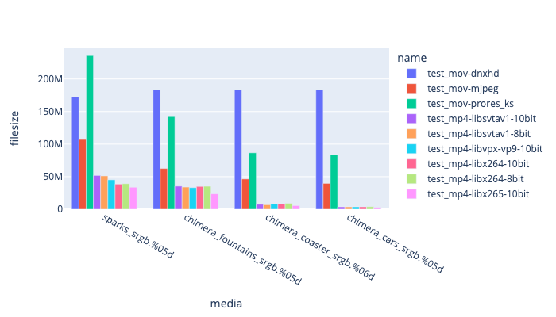

## Codec Comparisons 

Ffmpeg supports over 100 video codecs, but only a fraction of those are really worth a deeper dive.

We are going to focus on codecs that match one of the following conditions:
   * Supported by common web browsers.
   * Have good compression ratios with good color fidelity.
   * Supported by common apps, e.g. Resolve, RV, AVID.

## Encoding 

A good starting point for encoding options is here: [https://trac.ffmpeg.org/wiki/Encode/VFX](https://trac.ffmpeg.org/wiki/Encode/VFX)

We have encoding guides for the following:
1. [h264](Encodeh264.html)
2. [Prores](EncodeProres.html)
3. [DNxHD](EncodeDNxHD.html)
4. [AV1](EncodeAv1.html)
5. [VP9](EncodeVP9.html)
6. [HEVC/H265](EncodeHevc.html)

## Codecs reviewed

| Codec Family | ffmpeg codec | Bit depth | Pixel format supported | Web Support | HDR | 
|------------|------------|------------|------------|------------|------------|
| [h264](Encodeh264.html) | x264 | 8 10 | YUV-4:4:4 yuv-4:2:2 YUV-4:2:0 | All Browsers | HLG |
| [VP9](EncodeVP9.html) | libvpx-vp9 | 8 10 12 | yuv-4:2:0 yuv-4:2:2 yuv-4:4:4 rgb rgb-10 rgb-12 | All Browsers | Yes |
| [HEVC/H265](EncodeHevc.html) | libx265 | 8 10 12 | yuv-4:2:0 yuv-4:2:2 yuv-4:4:4 rgb rgb-10 rgb-12 | All browsers | Yes |
| [HEVC/H265](EncodeHevc.html) | hevc_videotoolbox | 8 10 | yuv-4:2:0 yuv-4:2:2 yuv-4:4:4 rgb rgb-10 rgb-12 | All browsers | Yes |
| [AV1](EncodeAv1.html) | libsvtav1 | 8 10 | yuv-4:2:0 | Chrome Firefox Edge | Yes |
| [Prores](EncodeProres.html) | prores_ks | 10 | yuv-4:4:4 yuv-4:2:2 | Safari | ? |
| [DNxHD](EncodeDNxHD.html) | dnxhd | 8 10 | yuv-4:2:2 yuv-4:4:4 rgb | no | ? |
| [Mjpeg](EncodeMJPEG.html) | mjpeg | 8 | yuv-4:2:2 yuv-4:4:4 | no | no |

For a high level comparison we have encoded 4 sets of media using our recommended settings, all with the aim of getting the VMAF score > 98.  libx264 libstvav1 and vp9 were all encoded 4:2:0 and DNxHD and Prores were at 10-bit 4:2:2.

For details on codec flags, and how we picked the parameters, do goto the page for each codec.

|   Comparing encoding time for codecs applied to different media. |
|  Comparing filesize for codecs applied to different media. |
|  Comparing VMAF score for codecs applied to different media. |
|  Comparing PSNR-Y harmonic mean for codecs applied to different media.|

## Uncompressed containers

[Y4m](https://wiki.multimedia.cx/index.php/YUV4MPEG2) is a terrific container for uncompressed media. It allows uncompressed raw YCrCb data to be stored with a simple header.

## Uncompressed Codecs.

Ffmpeg has support for a small number of uncompressed codecs that are worth using for testing. We dont recommend any of them for day-to-day use.

| Codec | Description | Pix Fmt | Notes |
|:----------|:-----------|:-----------|:-----------|:-----------|:-----------|
| v410 | 444 10-bit | yuv444p10le | |
| v408 | 4444 8-bit with alpha | yuva444p | Quicktime compatible |
| v308 | 444 8-bit packed | yuv444p |
| v210 | 422 10-bit | yuv422p10le | |
| r210 | RGB 10-bit |
| png | PNG inside a quicktime, either 8 or 16-bit with or without alpha | rgb24 rgba rgb48be rgba64be pal8 gray ya8 gray16be ya16be monob |

## Other codecs worth considering.

Below are other codecs that may be worth considering at some point.

| Codec | Profile description | Pix Fmt | Notes |
|:----------|:-----------|:-----------|:-----------|:-----------|:-----------|
| jpeg2000 | jpeg2000 codec | 
| libopenjpeg | jpeg2000 codec using the libopenjpeg library | 
| hap | HAP and HAPQ codec | rgba |  [HAP](https://hap.video/using-hap.html) - Fast GPU decompression, at the expense of file-size |
| LCEVC | | | [Low Complexity Enhancement Video Coding](https://docs.v-nova.com/v-nova/lcevc/reference-applications/ffmpeg) |

See:
   * https://blog.frame.io/2017/02/13/compare-50-intermediate-codecs/
   
### HTJ2K

HTJ2K is a modification of the JPEG2000 codecs, where it has been modified to be more scalable, and sigificantly faster than the original jpeg2000 codec at the expense of a slight increase in file-size. The modification is now part of the JPEG2000 spec, and the decoder is now built into ffmpeg.

The codec is royalty free, and there are several open source implementations with non-GPL licenses.

TODO Investigate.

See: 
* https://htj2k.com/
   * https://www.frontiersin.org/articles/10.3389/frsip.2022.885644/full
   * https://github.com/osamu620/OpenHTJ2K

TODO:
* Figure out the missing metadata so that ffmpeg can correctly decode a quicktime to still.
* 
