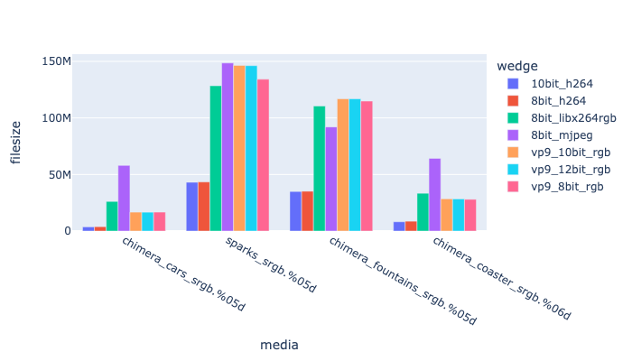
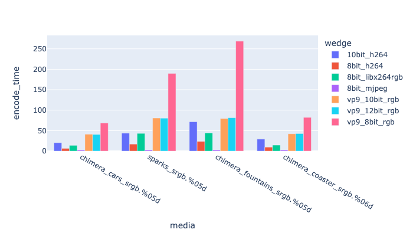
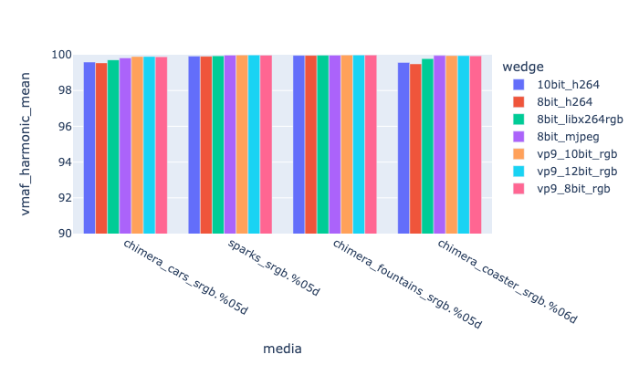

# RGB Encoding <a name="rgbencode"></a>
You do not *have* to encode into YCrCb, there are a number of codecs that support RGB directly.

It does lower the compression efficiency a little, but eliminates any concern that the YCrCb conversion is affecting the imagery.

| Codec Family | ffmpeg codec | Bit depth |  pix_fmt | Web Support | 
|------------|------------|------------|------------|
| [h264](Encodeh264.html) | libx264rgb | 8 |  | no | 
| [HEVC/H265](EncodeHevc.html) | libx265 | 8 10 12 | rgb rgb-10 rgb-12 | All browsers | 
| [HEVC/H265](EncodeHevc.html) | hevc_videotoolbox | 8 10 | rgb rgb-10 rgb-12 | All browsers | 
| [VP9](EncodeVP9.html) | libvpx-vp9 | 8 10 12 | rgb rgb-10 rgb-12 | All Browsers | 
| [Mjpeg](EncodeMJPEG.html) | mjpeg | 8 | yuv-4:2:2 yuv-4:4:4 | no | 
| [DNxHD](EncodeDNXHD.html) | dnxhd | 8 10 | rgb | no | 
| [HTJ2K](EncodeHTJ2K.html) |  | 8 -> 16 | rgb | no | 


## H264 RGB Encoding

h264 does support RGB encoding, which may be preferable in some situations.

Using the encoder:
```
-c:v libx264rgb
```

Has no support in web browsers, but there is limited support in players such as RV. This is pretty obsolete, you can do something now similarly with libx264.

## mjpeg RGB Encoding

For more details see: [Mjpeg](EncodeMJPEG.html). This is an 8-bit only encode.

```
	-c:v mjpeg -color_primaries bt709 -color_range pc -color_trc bt709 -colorspace rgb -pix_fmt rgb24 -q:v 2 -vf "scale=in_range=full:out_range=full"
```

## VP9 RGB Encoding

VP9 has some excellent 10 and 12 bit RGB encodes.

Example encoding:

<!---
name: test_vp9
sources: 
- sourceimages/chip-chart-1080-16bit-noicc.png.yml
comparisontest:
   - testtype: idiff
   - testtype: assertresults
     tests:
     - assert: less
       value: max_error
       less: 0.00195
-->
```
ffmpeg -r 24 -start_number 1 -i inputfile.%04d.png -frames:v 200 -c:v libvpx-vp9 \
    -crf 22 -pix_fmt gbrp10le -quality good -row-mt 1 -speed 2 -vf "scale=in_range=full:out_range=full" \
    -color_primaries bt709 -color_range pc -color_trc bt709 -colorspace rgb   \
     -y outputfile.mp4
```


## RGB Comparisons


| *label* | *Codec Params* |
| 8_bit_libx264rgb | -c:v libx264rgb -color_primaries bt709 -color_range pc -color_trc bt709 -colorspace rgb -crf 18 -pix_fmt rgb24 -preset slow -vf "scale=in_range=full:out_range=full" -x264-params keyint=15:no-deblock=1 |
| 8bit_mjpeg | -c:v mjpeg -color_primaries bt709 -color_range pc -color_trc bt709 -colorspace rgb -pix_fmt rgb24 -q:v 2 -vf "scale=in_range=full:out_range=full" |
| vp9_10bit_rgb | -c:v libvpx-vp9 -color_primaries bt709 -color_range pc -color_trc bt709 -colorspace rgb -crf 22 -pix_fmt gbrp10le -quality good -row-mt 1 -speed 2 -vf "scale=in_range=full:out_range=full" |
| vp9_12bit_rgb | -c:v libvpx-vp9 -color_primaries bt709 -color_range pc -color_trc bt709 -colorspace rgb -crf 22 -pix_fmt gbrp12le -quality good -row-mt 1 -speed 2 -vf "scale=in_range=full:out_range=full" |
| vp9_8bit_rgb | -c:v libvpx-vp9 -color_primaries bt709 -color_range pc -color_trc bt709 -colorspace rgb -crf 22 -pix_fmt gbrp -quality good -vf "scale=in_range=full:out_range |

|  This is showing different rgb encoding against file size. |
|  This is showing different rgb encoding against encoding time |
|  This is showing different rgb encoding against mean VMAF |


For more details see:
   * [Comparing full-range vs. tv range](https://academysoftwarefoundation.github.io/EncodingGuidelines/tests/greyramp-fulltv/compare.html)
   * [Encoding Guide](Encoding.html#range)
