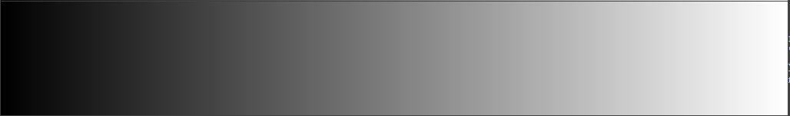

<style>
.compare th, .compare td {
    padding: 2px 2px !important;
    border: 0px solid #e9ebec !important;
}
</style>

# Color Metadata and Web Color Preservation <a name="nclc"></a>


<details open markdown="block">
  <summary>
    Table of contents
  </summary>
  {: .text-delta }
1. TOC
{:toc}
</details>

There are a number of metadata flags designed to help the player know what colorspace the media is in, so it can correctly interpret it for playback. We do recommend adding the metadata tags to media, particularly if you are reviewing it on a web browser, however there are a lot of gotchas here.

The NCLC/NCLX is defined as a ISO spec here (see [ISO-23091](https://www.iso.org/standard/73412.html) ). The numbers below are part of the definition. NCLC stands for Non-Consistent Luminance Coding, a brief overview of its history is here. For MP4 files, its also known as NCLX. Additionally this metadata can also be represented in the h264 metadata stream in the video usability Information (VUI) block.

You can read the metadata using [mp4box.js](https://gpac.github.io/mp4box.js/test/filereader.html) which is a visual browser of the mp4 metadata, and look at moov/trak/mdia/minf/stbl/stsd/avc1/colr property.

NOTE: None of the flags below affect the encoding of the source imagery, they are meant to be used to guide how the mp4 file is decoded.

The docs are pretty sparse for this, some of the better info is [FFmpeg/pixfmt.h at master](https://github.com/FFmpeg/FFmpeg/blob/master/libavutil/pixfmt.h)

There are four possible tags that you can apply to movies:
  * <a href='#transfer-function-tests-color_trc-flag'>color_trc</a> - The transfer function (e.g. gamma)
  * <a href='#colorprimaries'>color_primaries</a> - e.g. bt709, rec2020, display-p3
  * <a href="#color_range">color_range</a> - Is it tv vs. full range
  * <a href="#color_space">color_space</a> - Is it YUV vs. RGB


For a detailed breakdown of what browsers support what flags see: [here](https://wiki.aswf.io/display/PRWG/Color+fidelity+for+Web+Browsers)


# Transfer function tests (color_trc flag)
This is setting the transfer function, which is typically going to be related to the gamma of the display. There are a number of existing gamma profiles, e.g. bt709 or sRGB, as well as gamma 2.2, and 2.8. Having said that, bt709 is frankly rather useless, consequently we recommend using sRGB as a default.

For more details see: [here](tests/greramp-osx/ycrcbcompare.md)

## sRGB
Using the `-color_trc iec61966-2-1` flag (the sRGB spec is defined as [iec61966-2-1](https://en.wikipedia.org/wiki/SRGB) ). This appears to be the most reliable one, working across all machines and browsers that support it. It's a shame that the flag has to be so cryptic. 

<table class='compare'>
<TR><TD></TD><TD>Source sRGB PNG</TD></TR>
<TR><TD><video width=400><source src="tests/greyramp-osx/greyscale-srgb.mp4"></video></TD><TD>Mp4 Video should match PNG</TD></TR>
</table>

## bt709
Using the `-color_trc bt709` flag (AKA rec709). This is often the default tag, however produces the most confusing results. On Chrome this will actually match sRGB, but on safari it will match the camera bt709 parameters, which roughly match gamma 1.95. NOTE, there is no support at all for BT1886, which is what we would conventionally use for the TV gamma of 2.4, the closest you can get is using Quicktime on OSX. See [Apple Quicktime gamma](#apple-quicktime-gamma-and-bt1886) for the workaround.

<table  class='compare'>
<TR><TD><video width=400><source src="tests/greyramp-osx/greyscale-rec709.mp4"></video></TD><TD>This is the bt709 mp4.</TD></TR>
<TR x-show="/^((?!chrome|android).)*safari/i.test(navigator.userAgent)"><TD><video width=400><source src="tests/greyramp-osx/greyscale-gamma195.mov"></video></TD><TD>This is a Quicktime with a gamma of 1.95. This should be nearly identical to the above bt709 mp4, which implies OSX is correctly interpreting camera bt709.</TD></TR>
<TR><TD><video width=400><source src="tests/greyramp-osx/greyscale-srgb.mp4"></video></TD><TD>This is the srgb.mp4 which may match the bt709 result. For chrome on windows, this should match bt709, which implies its treating it as sRGB.</TD></TR>
</table>

Screenshots
<table class='compare'>
<TR><TD></TD><TD>Screenshot of mp4 of chrome on windows</TD></TR>
<TR><TD></TD><TD>Screenshot of mp4 of safari on OSX</TD></TR>
</table>

## Gamma 2.2
Using the `-color_trc gamma22` flag. This does not work correctly on safari, see [Color-TRC Comparison for OSX](/EncodingGuidelines/tests/greyramp-osx/compare.html)

<table class='compare'>
<TR><TD></TD><TD>Source gamma 2.2 PNG</TD></TR>
<TR><TD><video width=400><source src="tests/greyramp-osx/greyscale-gamma22.mp4"></video></TD><TD>Mp4 Video should match PNG</TD></TR>
</table>

## Gamma linear
Using the `-color_trc linear` flag. This is unlikely to ever be used for video, however it does make for a good test that something is working.

<table class='compare'>
<TR><TD></TD><TD>Source linear PNG</TD></TR>
<TR><TD><video width=400><source src="tests/greyramp-osx/greyscale-lin.mp4"></video></TD><TD>Mp4 Video should match PNG</TD></TR>
</table>

## Apple Quicktime Gamma and bt1886

Apple has a workaround flag for quicktime files that allows you to explicitly set the gamma of the file. Adding the flags
`-color_trc unknown -movflags write_colr+write_gama -mov_gamma 2.4` would correctly set the gamma of the media to bt1886 on Apple hardware. You can similarly use this for any other gamma, see: [Color-TRC Comparison for OSX](/EncodingGuidelines/tests/greyramp-osx/compare.html). NOTE, you do need the `-color_trc unknown` so that it knows to fall back on the mov_gamma value. 

<!---
name: test_movgama
sources: 
- sourceimages/smptehdbars_8.png.yml
comparisontest:
   - testtype: idiff
     compare_image: ../sourceimages/smptehdbars_8_yuv420p.png
   - testtype: assertresults
     tests:
     - assert: less
       value: max_error
       less: 0.00195
-->
```console
ffmpeg -r 24 -start_number 1 -i inputfile.%04d.png \
-sws_flags area+accurate_rnd+full_chroma_int -pix_fmt yuv420p \
-vf "scale=in_range=full:in_color_matrix=bt709:out_range=tv:out_color_matrix=bt709" \
-c:v libx264 -t 5 -qscale:v 1  -color_range tv -colorspace bt709 -color_primaries bt709 \
-color_trc unknown -movflags write_colr+write_gama -mov_gamma 2.4 outputfile.mov
```

## Summary
We recommend the use of `-color_trc iec61966-2-1` to use sRGB. There is no support for a gamma 2.4, if you still need it, we recommend that you use -color_trc unknown and ensure that your monitor is set correctly


# Gamut colorprimaries

Normally web browsers use the bt709 color gamut (which is different to the bt709 gamma), but in theory you could define your media as having a wider gamut, e.g. DCI-P3 or rec2020. The files below show a PNG and MP4 file defined using the rec2020 gamut, so depending on which monitor you are using it will show different text. This is similar to the excellent [WIDE>Gamut](https://www.wide-gamut.com/) test page.

<table class='compare' width='100%'>
<TR><TH>PNG file</TH><TH>Mp4 file (which should match PNG file)</TH></TR>
<TR><TD></td><td><video   width='316'   ><source src='gamuttests/iccgamut/greyscale-rec2020.mp4' type='video/mp4'/></video></td></TR>
</table>


<table class='compare' width='100%'>
<TR><TD></TD><TD>What the image should look like if nothing is working, or you have a rec2020 monitor.</TD></TR>
<TR><TD></TD><TD>What the image should look like if you have a display-p3 monitor.</TD></TR>
</table>

Chrome on windows, and Safari and Chrome on IOS will always assume the display is sRGB. In theory [chrome://flags/#force-color-profile](chrome://flags/#force-color-profile) should give you some settings for this, but it seems to be ignored.


# Web Review Testing<a name="webreview"></a>
See:
* [NCLC Testing Overview](https://academysoftwarefoundation.github.io/EncodingGuidelines/compare.html) This is an overview of the NCLC Tag tests for web review.
* [Comparing different outputs for -color_trc](https://academysoftwarefoundation.github.io/EncodingGuidelines/tests/greyramp-osx/compare.html) - Showing what the -color_trc flag is doing, compared to embedding in mov and png.
* [Comparing different outputs for the -colorprimaries](https://academysoftwarefoundation.github.io/EncodingGuidelines/gamuttests/iccgamut/compare.html)
