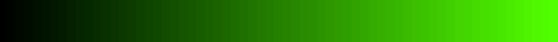
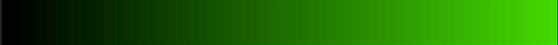
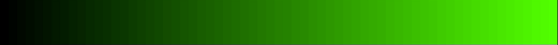

# ORI Encoding Guidelines.

A project from within the [https://openreviewinitiative.org/](ASWF Open Review Initiative), attempts to establish best practices for encoding Video media for VFX/Animation media review. We aim to explain what various parameters do, and in what situations you might want to choose to modify them.

This is not the site for general encoding, although you may find answers here, we will likely opt for a simple one-size fits all solution over file-size efficiency.
We welcome suggestions and improvements.

The main confluence page for this for now is [here](https://wiki.aswf.io/pages/viewpage.action?pageId=16031068)

## Why is this needed.

There are a lot of excellent guides out there. But few addressing the needs of the VFX community. 

An example of why this is important is to compare:

| Original PNG image |  | |
| Default ffmpeg conversion |  | NOTE color shift compared to original |
| Using the libavscale library |  | should match original |

You can see the default ffmpeg conversion introduces a dramatic colorshift that if you use the right flags, you can match the original. See [Color space conversion](ColorPreservation.html#Color-space-conversion) for more details on this.

1. [Acknowledgements](#Acknowledgements)
2. [Encoding Cheat Sheet](Quickstart.html)
3. [Encoding Overview](Encoding.html#Encoding-Overview)
4. [Color space conversion](ColorPreservation.html#Color-space-conversion)
5. [Media Encoding with ffmpeg](ColorPreservation.html#encodestart)
	1. [RGB to YCrCb Conversion](ColorPreservation.html#yuv)
	2. [TV vs. Full range.](ColorPreservation.html#tvfull)
	3. [RGB encode](ColorPreservation.html#rgbencode)
6. [Encoding](Encoding.html#encode)
	1. [h264](Encoding.html#h264)
	2. [Prores](Encoding.html#prores)
7. [Metadata NCLC/NCLX](ColorPreservation.html#nclc)
	1. [Gamut - colorprimaries](ColorPreservation.html#gamut)
	2. [Color Range](ColorPreservation.html#range)
8. [Web Review](ColorPreservation.html#webreview)

### Acknowledgements  

This document is a result of feedback from many people, in particular I would like to thank Kevin Wheatley, Gates Roberg Clark, Rick Sayre, Wendy Heffner and J Schulte for their time and patience.  

### Status

This document and project is still a work in progress. We are working on building a more complete testing framework, so that it is easy to confirm that changes to ffmpeg are not breaking existing functionality.

### Authors

This document is primarily the work of Sam Richards. The test suite was developed by Daniel Flehner Heen.

### Feedback and error reporting.

We welcome feedback on this document, please report any errors or suggestions to the [github issues](https://github.com/richardssam/ffmpeg-tests/issues) page. 
